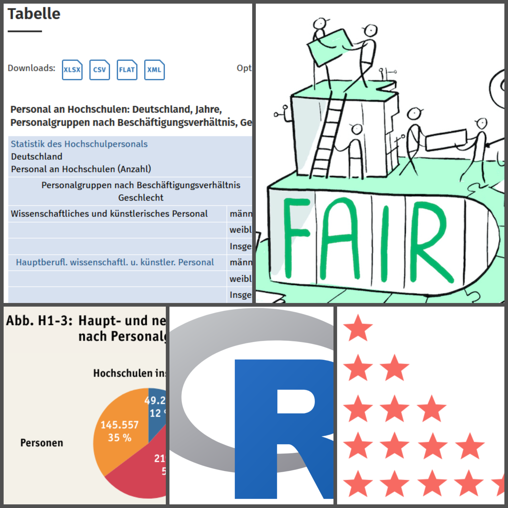

# Reproduzierbarkeit von Datenanalysen





Diese Fallstudie bildet mit Hilfe eines Jupyter Books einen Forschungsverlauf in der Verwaltungswissenschaft nach. Dabei wird anhand einer modellhaften Forschungsfrage auf die Reproduzierbarkeit von Analysen und Forschungsergebnissen eingegangen. Dazu werden in einzelnen Kapiteln die Themen Datennachnutzung, Bewertung von Datenqualität und Nachvollziehbarkeit von Analysen behandelt.


## Fokus

Im Fokus stehen dabei Daten des Nationalen Bildungsberichts (2022), anhand derer die Forschungsfrage formuliert wurde: 
**Wie hat sich die Zusammensetzung des Personals an Hochschulen in Deutschland im letzten Jahrzehnt (2010-2020) entwickelt?**
Um diese zu beantworten, vermittelt diese Fallstudie Kenntnisse in Bezug auf qualitative Bewertungskriterien und Datenmanagement sowie Grundkenntnisse in der Benutzung der statistischen Software R. Diese werden dazu eingesetzt, die Reproduzierbarkeit von datenbasierten Ergebnissen zu prüfen, um schließlich mit einer eigenen Abfrage die Forschungsfrage zu lösen.


## Bedeutung

Neben der bereits elementaren Nutzung statistischer Daten in der Verwaltungswissenschaft, gewinnt die Nachnutzung von Forschungsdaten zunehmend an Bedeutung. Die in dieser Fallstudie erlernbaren Tools helfen dabei, die Reproduzierbarkeit von Analysen und Ergebnissen zu prüfen und zu bewerten. Durch die hier gezeigten Schritte der Datenmanipulation lassen sich Tabellen bereinigen, um so weitere datengetriebene Analysen durchzuführen.


## Lernziele

`````{admonition} Groblernziel 1
:class: keypoints
````{admonition} Feinlernziel 1
:class: dropdown
Feinlernziel 1 Beschreibung
````
`````
