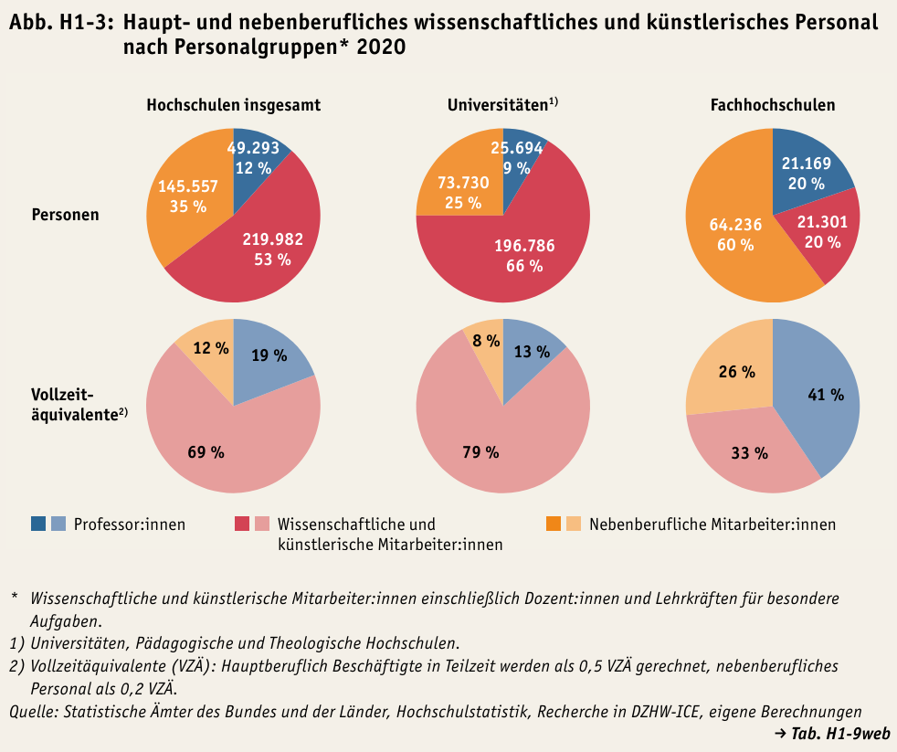
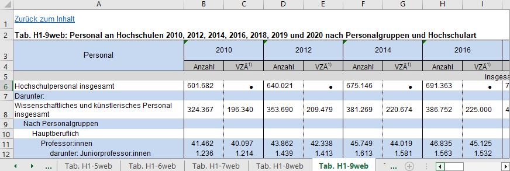

(Datenbasis)=
# Datenbasis: Nationaler Bildungsbericht 

Diese Fallstudie des Datentyps Tabelle arbeitet mit strukturierten Daten, also Daten, die in einem vorgegebenen Format organisiert und sortiert sind. Als Arbeitsgrundlage dienen Daten des Nationalen Bildungsberichts (2022) und von Destatis.

Der Nationale Bildungsbericht bereitet Daten für ein nationales Bildungsmonitoring aus unterschiedlichen Datenquellen auf und stellt den Report sowie die aufbereiteten Datensätze unter diesem <a href="https://www.bildungsbericht.de/de/bildungsberichte-seit-2006/bildungsbericht-2022/bildung-in-deutschland-2022#10" target="_blank">Link</a> bereit. Es gibt jeweils eine Online-Version im Format PDF und eine Printversion. Die aufbereiteten Daten werden im Excel-Format zum Download bereitgestellt. 

Bitte beachten Sie, dass diese Fallstudie sich auf den Bildungsbericht **2022** bezieht. Wenn Sie den hier angegebenen Links folgen, sollten Sie kein Problem bekommen. Wenn Sie aber über die Startseite des Bildungsberichts gehen, wird Ihnen der jeweils aktuellste Bericht angezeigt. Die Bildungsberichte werden alle zwei Jahre mit unterschiedlichen Schwerpunktthemen veröffentlicht.

Alternativ können Sie den Bericht auch aus unserem Repository laden: [Bildungsbericht 2022](Data/bildungsbericht-2022.pdf)

Die für die Forschungsfrage relevanten Informationen zur Entwicklung des Hochschulpersonals finden sich im Kapitel H - "Bildungspersonal: Struktur, Entwicklung, Qualität und Professionalisierung", das auf der Website des <a href="https://www.bildungsbericht.de/de/bildungsberichte-seit-2006/bildungsbericht-2022/pdf-dateien-2022/bildungsbericht-2022-kapitel-h.pdf" target="_blank">Bildungsberichts</a> auch einzeln aufrufbar ist, auf S. 258 ff. Die Visualisierungen Abb. H1-3 (S. 259) und Abb. H1-4 (S. 260) stellen die Verteilung des haupt- und nebenberuflichen Personals bzw. das aus Grundmitteln finanzierte Personal im Verhältnis zur Studierendenzahl dar. 

Für diese Fallstudie ist die erstgenannte Abbildung H1-3 (s. unten, Abb. 2) von Bedeutung, die sich auf die Tabelle H1 - "Personalbestand und Personalstruktur" bezieht. Diese finden Sie auf der Hauptseite des Bildungsberichts (2022), die sie über den oben angegebenen Link erreichen. Alternativ können Sie den Tabellenanhang über das zu dieser Fallstudie bereitgestellte Repository ([Excel-Tabelle](Data/h1-anhang.xlsx)) oder über die <a href="https://www.bildungsbericht.de/de/bildungsberichte-seit-2006/bildungsbericht-2022/excel-bildungsbericht-2022/h1-anhang.xlsx">Website des Bildungsberichts</a> direkt herunterladen.  

*Abbildung 2: Abb.H1-3 aus dem nationalen Bildungsbericht 2022*  

Die Daten, die zur Erzeugung der Visualisierung verwendet wurden, finden sich im Reiter "H1-9web: Personal an Hochschulen 2010, 2012, 2014, 2016, 2018, 2019 und 2020 nach Personalgruppen und Hochschulart" der Excel-Tabelle (s. Abb. 3).  

*Abbildung 3: Tab.H1-9web*  

Da es sich bei dieser Tabelle um aggregierte Daten handelt, ist es sinnvoll, die Rohdaten für diese Daten zu suchen, da die Daten im Rahmen der Fallstudie im Sinn der Reproduzierbarkeit erneut analysiert werden sollen und sich Daten im CSV-Format besser weiterverarbeiten lassen als im Excel-Format. Dies erfolgt Schritt für Schritt in einem späteren Kapitel.  

Bevor wir das tun, werden wir Sie im Kapitel **2. Datennachnutzung und FAIR-Prinzipien** aber zunächst mit dem Thema Datennachnutzung vertraut machen. Dazu untersuchen wir unter anderem die Qualität des Datensatzes anhand der FAIR-Prinzipien.
