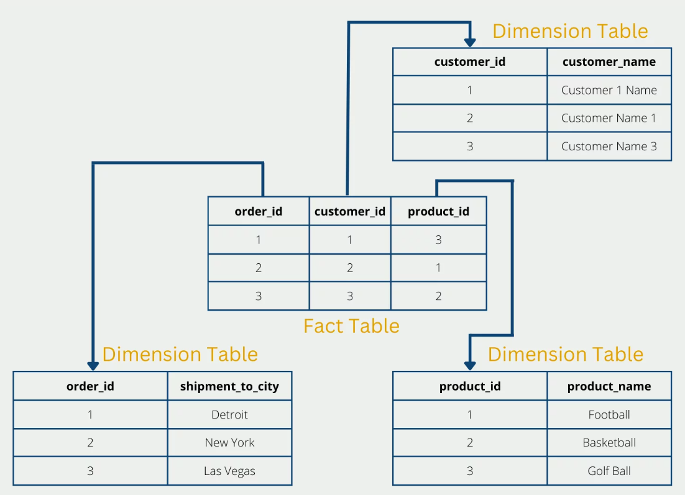
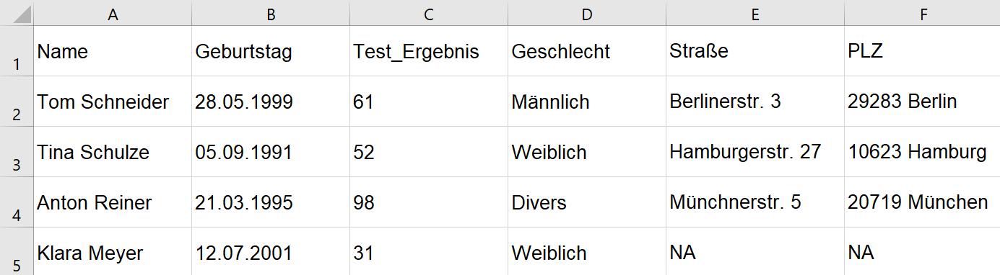
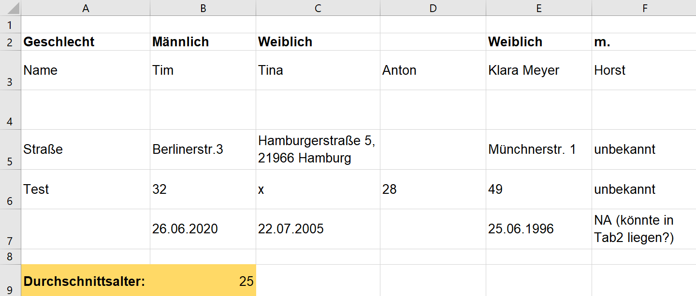

# Datenstruktur

Die Struktur eines Datensatzes prägt maßgeblich dessen maschinelle Lesbarkeit und Auswertungsmöglichkeiten. Für eine effiziente Datenmanipulation bedarf es eines gut strukturierten Datensatzes. In den meisten Fällen haben Sie jedoch nicht nur einen Datensatz, sondern ganz viele. Daher kommt folgende Frage auf:

```{admonition} Frage
:class: lernziele
Worauf sollte bei einer guten Datenorganisation und -strukturierung geachtet werden? 
```


## Datenorganisation

Für eine gute Datenorganisation ist ein Kriterium elementar: Die Konsistenz. Denn Konsistenz innerhalb sowie über alle Datensätze hinweg spielt im Kontext der Verknüpfbarkeit von Datensätzen eine entscheidende Rolle {cite}`broman_data_2018,groves_federal_2017`. Wenn in unterschiedlichen Datensätzen verschiedene Informationen zu Personen gesammelt werden, kann eine effiziente Verknüpfung nur über ein in allen Datensätzen vorhandenes konsistentes Variablenmerkmal (z.B. Name, Steuer-ID, Sozialversicherungsnummer) gesetzt werden. Dieses Variablenmerkmal sollte im besten Fall einzigartig sein und eine Person klar identifizieren können. {cite}`groves_federal_2017` zeigen die Wichtigkeit dieser Konsistenz am Beispiel der Namensgebung auf: Wenn die Person Dr. Max Tom Mustermann in verschiedenen Datensätzen mal als „Max Mustermann“ oder „Dr. Mustermann“ oder auch „Max Tom Mustermann“ abgespeichert wird, ist eine simple Verknüpfung der Informationen aus den Datensätzen mittels des Namens einer Person nicht möglich. Zudem ist zu beachten, dass sich Namen doppeln können und es sich hier nicht um ein einzigartiges Merkmal handelt. Hier müssten weitere Merkmale (z.B. Adresse, Ausweisnummer) in Kombination verwendet werden, um ein Individuum klar zu identifizieren und dessen Informationen zu aggregieren {cite}`groves_federal_2017`. Außerdem sollten Sie für eine höhere Konsistenz Standardlösungen für verschiedene Szenarien entwerfen. Beispielsweise sollten fehlende Werte immer durch die gleiche Bezeichnung (z.B. „NA“) kenntlich gemacht werden. Somit enthält die Datei auch keine leeren Zellen, welches bei der Auswertung ansonsten zu Problemen führen kann. Zudem sollten sie Formate zum Beispiel wie das Format der Datumsanzeige fest vergeben und diese immer einhalten (z.B. 26/02/1996).  

Im Kontext der Datenorganisation ist es zudem ratsam, sich mit der Normalisierung von Datenbanken auseinanderzusetzen. Die Normalisierung von Datenbanken zielt darauf ab, Redundanzen zu minimieren und die Datenintegrität der Daten zu verbessern. Dies wird erreicht, indem die Daten in kleinere, gut strukturierte Tabellen aufgeteilt werden, die durch Beziehungen miteinander verbunden sind. Hierdurch wird jede Information nur einmal abgespeichert. Durch die Normalisierung können Probleme beim Einfügen, Löschen und Aktualisieren von Daten in der Datenbank vermieden werden, was dazu beiträgt, Fehlinformationen in der Datenbank zu vermeiden und die Konsistenz der Daten zu gewährleisten {cite}`codd_further_1971`, {cite}`khodorovskii_normalization_2002`. 

Beispielhafte simple Form der Datennormalisierung:
  
*Abbildung nach Niklas Lang{cite}`noauthor_what_2023`*

```{admonition} Weitere Informationen
:class: seealso
Weitere Informationen erhalten Sie im Blog <a href="https://databasecamp.de/daten/normalisierung" target="_blank">Data Base Camp</a>, von dem wir die obige Grafik nachgenutzt haben.  
```


(Tidy_data)=
## Tidy-Data-Struktur
Eine sinnvolle Struktur für Ihre Daten ist unerlässlich. Ein weitverbreiteter Standard für diese Struktur setzt das sogenannte „Tidy Dataset“ {cite}`wickham_tidy_2014`. Ein Datensatz wird als „Tidy“ bezeichnet, wenn es folgende Struktur erfüllt:

1. Jede Variable ist eine Spalte

2. Jede Beobachtung ist eine Zeile

3. jeder einzelne Wert (Datenpunkt) wird
einer Variable und einer Beobachtung zugeordnet.

Nach dieser Struktur enthält jede Zelle exakt einen Wert und ist klar einer einzigen Variable zuzuordnen. Es entsteht ein rechteckiges Layout. Wenn Sie Berechnungen auf Basis der Tabellendaten durchführen möchten, sollten dies nie in der Raw-Data Datei erfolgen. Eine saubere Datei enthält nur eine einzige ausgefüllte Tabelle. Außerdem ist in der Raw-Data Datei auf jegliche Formen von optischen Hervorhebungen (z.B. Fettdruck, farbliche Markierungen, etc.) zu verzichten {cite}`broman_data_2018,wickham_tidy_2014`. 

Beispiel für eine gute Tidy-Data-Struktur: 
 

Durch Einhaltung dieser Struktur entsteht eine Tabelle, die eine schnelle, einfache und vor allem konsistente Datenmanipulation und -auswertung ermöglicht {cite}`broman_data_2018,wickham_tidy_2014`.

Beispiel für keine Tidy-Data-Struktur:
 

 
````{admonition} Quiz
:class: exercise

Die obige abgebildete Raw-Data-Tabelle weist mehrere Mängel auf und entspricht nicht den Maßstäben einer Tidy-Data-Struktur. Können Sie alle Fehler finden? 


```{admonition} Lösung
:class: solution, dropdown
- (1)	Inkonsistenz

- (2)	Zellen enthalten mehr als nur einen Inhalt

- (3)	Leere Zellen
  
- (4) Variablen sind nicht spaltenweise angeordnet
  
- (5)	Fehlende Variablenname
  
- (6)	Es werden Berechnungen durchgeführt
  
- (7) Es werden optische Hervorhebungen verwendet
```
````
 
Nach Wickham (2014) sind die häufigsten Fehler im Aufbau von Datensätzen folgende:

- Spaltenüberschriften sind keine vernünftigen Variablennamen sondern numerische Werte.
- Mehrere Variablen werden in einer Spalte gespeichert.
- Variablen werden sowohl in Spalten als auch in Zeilen gespeichert.
- Verschiedene Beobachtungseinheiten (z.B. Kilo/Pfund/Unze) werden unter derselben Variable gespeichert.
- Eine einzelne Beobachtungseinheit wird wiederholt in mehreren Datensätzen gespeichert.


```{admonition} Hinweis
:class: hinweis
Nun stellt sich bei Ihnen sicherlich die Frage, wie es um unser Raw-Data-Set des Statistischen Bundesamtes steht? Weist dieses eine vorbildliche Struktur auf? Diese Frage wird in der folgenden Lerneinheit [Übung: Arbeiten mit CSV-Dateien in R](Übung_csv) beantwortet.
```
