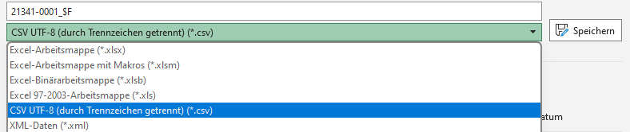

(Übung_csv)=
# Übung: Arbeiten mit CSV-Dateien in R

## Vorwort

Die folgende Lerneinheit soll Ihnen den Ersteinstieg in die Programmiersprache **R** erleichtern. Um der Übungseinheit effektiv folgen zu können, installieren Sie bitte **R** und **RStudio**. Hinweise zur Installation finden Sie [hier](https://quadriga-dk.github.io/Tabelle-Fallstudie-1/Markdown/28_Installation_R.html).  
Als Fallbeispiel wird eine CSV-Datei mit Rohdaten zum *Personalstand an Hochschulen* eingelesen und ausgewertet. Entweder haben Sie diese Datei schon in [Kapitel 3](https://quadriga-dk.github.io/Tabelle-Fallstudie-1/Markdown/11_XLSXundCSV.html) heruntergeladen oder Sie klicken [hier](Data/21341-0001_F_2020.csv) um die CSV-Datei aus unserem Repositorium direkt herunterzuladen (Quelle: Statistisches Bundesamt 2022).  

------------------------------------------------------------------------

## Einleitung

> Für Computersprachen gilt allgemein: Es gibt nie nur einen Weg zum
> Ziel. Unterschiedliche Befehle können Sie zum gleichen Ziel bringen.
> Dieses gilt auch für die folgenden angeführten Befehle.

Damit Sie die in diesem Skript angeführten Befehle verwenden können,
müssen Sie das folgende Package installieren und laden:
```
install.packages("tidyverse")
library(tidyverse)
```

(Einlesen_csv)=
### Einlesen von CSV Dateien

Hierfür gibt es zwei Befehle: `read.csv()` oder `read.csv2()`  

-   `read.csv()` wird verwendet, wenn die CSV Dateiwerte durch Kommata
    separiert werden.  
      
-   `read.csv2()` wird verwendet, wenn die CSV Dateiwerte durch Semikola
    separiert werden.  
      

**Fallbeispiel:**

```
#Daten einlesen
data_csv <- read.csv2("21341-0001_F_2020.csv",header = FALSE)
```

**Erklärung des Codes:**  

-   `#Daten einlesen`:  
    Durch das setzen eines `#` wird der folgende Inhalt in der Zeile
    nicht als Code interpretiert und somit auch nicht ausgeführt. Wenn
    Sie Textbausteine, Kommentare, Überschriften etc. in Ihrem
    **R-Skript** integrieren möchten, was für eine bessere
    Nachvollziehbarkeit Ihres Skriptes zu empfehlen ist, benutzen Sie
    immer das `#`-Symbol, um dies kenntlich zu machen. Ansonsten wird
    **R** einen Error ausgeben.  

-   `read.csv2()`:  
    Die verwendete Datei ist durch Semikola separiert. Deswegen wird
    hier `read.csv2()` verwendet.  

    -   *Woraus ist dies ersichtlich? Durch Öffnen der Datei in der
        Console Ihres Rechners können Sie die verwendeten Trennzeichen
        erkennen.*  
          

-   `"21341-0001_F_2020.csv"`:  
    Hier steht der Name der CSV-Datei, die geladen werden soll.  

    -   Bei Verwendung von RStudio: Sie sollten unter *Files* den
        Ordner aufrufen, in dem Ihre Dateien gespeichert sind. Nach dem
        Klicken auf die gewünschte Datei, können Sie die Option **Import
        Dataset…** nutzen.  
          

-   `header = FALSE`:  
    Die CSV Datei hat keine Überschriften, daher muss hier der Zusatz
    hinzugefügt werden.  
      

-   `data_csv <-`:  
    Damit Sie einen Befehl nicht immer wieder ausführen müssen, können
    Sie dem Befehl mittels eines Pfeils `<-` einem Namen zuordnen.  

    -   Hier: “data\_csv”. Nun können Sie in dem folgenden Skript nur
        noch den gesetzten Namen verwenden.  
          

***Alternative:*** *Falls die Datei nicht unter “Files” auffindbar ist,
kann auch der Befehl `choose.files()` genutzt werden:*  
```
data_csv <- read.csv2(choose.files(),header = FALSE)
```
 
`````{admonition} Tipp
:class: keypoint
Wenn Sie die Bedeutung und Syntax eines Befehls besser verstehen wollen, empfielt es sich, diesen Befehl im Handbuch nachzuschlagen. Hierzu setzen Sie ein `?` vor den Befehl Ihres Interesses.
`````

*Beispiel:*  
```
?read.csv2
```
------------------------------------------------------------------------

## Daten sichten

Es ist immer ratsam, einen ersten Blick auf die Daten zu werfen, um
deren Struktur zu verstehen. Dazu verwenden Sie folgenden Befehl:  
```
show(data_csv)
```

```
    ##                                                                 V1	   V2	    V3
    ## 1                                      GENESIS-Tabelle: 21341-0001            
    ## 2                     Personal an Hochschulen: Deutschland, Jahre,            
    ## 3  Personalgruppen nach Besch\xe4ftigungsverh\xe4ltnis, Geschlecht            
    ## 4                                 Statistik des Hochschulpersonals            
    ## 5                                                      Deutschland            
    ## 6                                 Personal an Hochschulen (Anzahl)            
    ## 7                                                                                2020
    ## 8                Wissenschaftliches und k\xfcnstlerisches Personal m\xe4nnlich	247720
    ## 9                Wissenschaftliches und k\xfcnstlerisches Personal    weiblich	167112
    ## 10               Wissenschaftliches und k\xfcnstlerisches Personal   Insgesamt 	414832
    ## 11            Hauptberufl. wissenschaftl. u. k\xfcnstler. Personal m\xe4nnlich	159567
    ## 12            Hauptberufl. wissenschaftl. u. k\xfcnstler. Personal    weiblich	109708
    ## 13            Hauptberufl. wissenschaftl. u. k\xfcnstler. Personal   Insgesamt	269275
    ## 14                                                     Professoren m\xe4nnlich	36344
    ## 15                                                     Professoren    weiblich	12949
    ## 16                                                     Professoren   Insgesamt	49293
    ## 17                                        Dozenten und Assistenten m\xe4nnlich	2182
    ## 18                                        Dozenten und Assistenten    weiblich	1546
    ## 19                                        Dozenten und Assistenten   Insgesamt	3728
    ## 20              Wissenschaftliche und k\xfcnstlerische Mitarbeiter m\xe4nnlich	116004
    ## 21              Wissenschaftliche und k\xfcnstlerische Mitarbeiter    weiblich	89383
    ## 22              Wissenschaftliche und k\xfcnstlerische Mitarbeiter   Insgesamt	205387
    ## 23                         Lehrkr\xe4fte f\xfcr besondere Aufgaben m\xe4nnlich	5037
    ## 24                         Lehrkr\xe4fte f\xfcr besondere Aufgaben    weiblich	5830
    ## 25                         Lehrkr\xe4fte f\xfcr besondere Aufgaben   Insgesamt	10867
    ## 26            Nebenberufl. wissenschaftl. u. k\xfcnstler. Personal m\xe4nnlich	88153
    ## 27            Nebenberufl. wissenschaftl. u. k\xfcnstler. Personal    weiblich	57404
    ## 28            Nebenberufl. wissenschaftl. u. k\xfcnstler. Personal   Insgesamt	145557
    ## 29                                        Gastprofessoren, Emeriti m\xe4nnlich	1534
    ## 30                                        Gastprofessoren, Emeriti    weiblich	259
    ## 31                                        Gastprofessoren, Emeriti   Insgesamt	1793
    ## 32                                                 Lehrbeauftragte m\xe4nnlich	64492
    ## 33                                                 Lehrbeauftragte    weiblich	35238
    ## 34                                                 Lehrbeauftragte   Insgesamt	99730
    ## 35                                Wissenschaftliche Hilfskr\xe4fte m\xe4nnlich	22127
    ## 36                                Wissenschaftliche Hilfskr\xe4fte    weiblich	21907
    ## 37                                Wissenschaftliche Hilfskr\xe4fte   Insgesamt	44034
    ## 38                Verwaltungs-, technisches und sonstiges Personal m\xe4nnlich	100320
    ## 39                Verwaltungs-, technisches und sonstiges Personal    weiblich	243913
    ## 40                Verwaltungs-, technisches und sonstiges Personal   Insgesamt	344233
    ## 41              Hauptberufl. Verwaltungs-, techn. u.sonst.Personal m\xe4nnlich	98247
    ## 42              Hauptberufl. Verwaltungs-, techn. u.sonst.Personal    weiblich	240419
    ## 43              Hauptberufl. Verwaltungs-, techn. u.sonst.Personal   Insgesamt	338666
    ## 44                                             Verwaltungspersonal m\xe4nnlich	25941
    ## 45                                             Verwaltungspersonal    weiblich	83918
    ## 46                                             Verwaltungspersonal   Insgesamt	109859
    ## 47                                             Bibliothekspersonal m\xe4nnlich	2443
    ## 48                                             Bibliothekspersonal    weiblich	7308
    ## 49                                             Bibliothekspersonal   Insgesamt	9751
    ## 50                                            Technisches Personal m\xe4nnlich	33025
    ## 51                                            Technisches Personal    weiblich	26360
    ## 52                                            Technisches Personal   Insgesamt	59385
    ## 53                                              Sonstiges Personal m\xe4nnlich	14422
    ## 54                                              Sonstiges Personal    weiblich	41609
    ## 55                                              Sonstiges Personal   Insgesamt	56031
    ## 56                                                  Pflegepersonal m\xe4nnlich	15427
    ## 57                                                  Pflegepersonal    weiblich	63731
    ## 58                                                  Pflegepersonal   Insgesamt	79158
    ## 59                                                        Arbeiter m\xe4nnlich	      -
    ## 60                                                        Arbeiter    weiblich	      -
    ## 61                                                        Arbeiter   Insgesamt	      -
    ## 62                                                   Auszubildende m\xe4nnlich	6284
    ## 63                                                   Auszubildende    weiblich	16137
    ## 64                                                   Auszubildende   Insgesamt	22421
    ## 65                                                    Praktikanten m\xe4nnlich	705
    ## 66                                                    Praktikanten    weiblich	1356
    ## 67                                                    Praktikanten   Insgesamt	2061
    ## 68                   Sonstiges Personal f\xfcr Lehre und Forschung m\xe4nnlich	      -
    ## 69                   Sonstiges Personal f\xfcr Lehre und Forschung    weiblich	      -
    ## 70                   Sonstiges Personal f\xfcr Lehre und Forschung   Insgesamt	      -
    ## 71                               Leitungs- und Verwaltungspersonal m\xe4nnlich	      -
    ## 72                               Leitungs- und Verwaltungspersonal    weiblich	      -
    ## 73                               Leitungs- und Verwaltungspersonal   Insgesamt	      -
    ## 74              Nebenberufl. Verwaltungs-, techn. u.sonst.Personal m\xe4nnlich	2073
    ## 75              Nebenberufl. Verwaltungs-, techn. u.sonst.Personal    weiblich	3494
    ## 76              Nebenberufl. Verwaltungs-, techn. u.sonst.Personal   Insgesamt	5567
    ## 77                                         Sonstige Hilfskr\xe4fte m\xe4nnlich	2073
    ## 78                                         Sonstige Hilfskr\xe4fte    weiblich	3494
    ## 79                                         Sonstige Hilfskr\xe4fte   Insgesamt	5567
    ## 80                                      Zeitweilig Besch\xe4ftigte m\xe4nnlich	      -
    ## 81                                      Zeitweilig Besch\xe4ftigte    weiblich	      -
    ## 82                                      Zeitweilig Besch\xe4ftigte   Insgesamt	      -
    ## 83                                                       Insgesamt m\xe4nnlich	348040
    ## 84                                                       Insgesamt    weiblich	411025
    ## 85                                                       Insgesamt   Insgesamt	759065
    ## 86                                                      __________            
    ## 87                   \xa9 Statistisches Bundesamt (Destatis), 2023            
    ## 88                                    Stand: 04.04.2024 / 18:30:01            
``` 

*Alternativ können Sie auch folgende Befehle nutzen:*
```
view(data_csv)
#oder
print(data_csv)
```

### Dateiinhalt interpretieren

Die Datei hat drei Spalten (V1, V2, V3):  

-   **V1:** In den Zeilen 1-6 und 87-88 stehen die Metadaten der Datei.
    Hier finden Sie Infos zum Herausgeber, Inhalt der Daten, etc..  
    In den Zeilen 8-85 befinden sich Bezeichnung zum
    Angestelltenverhältnis des Hochschulpersonals (Dozent,
    Gastprofessoren, etc.).  

-   **V2:** Diese Spalte unterteilt die Beschäftigten nach Geschlecht
    (männlich, weiblich & Insgesamt).  

-   **V3:** In den Zeilen 8-85 sind die jeweiligen absoluten
    Personalzahlen enthalten. In der Zeile 7 ist die Spaltenüberschrift
    “2020” gegeben. Diese bezieht sich auf das Erhebungsjahr der
    Daten.  
      

### Anmerkungen zu der Ausgangsdatei

Es fallen hier direkt mehrere Punkte auf, welche die CSV-Datei
schlechter maschinenlesbar machen:  

1.  Der Titel des Datensatzes ist nicht prägnant und verständlich.

2.  Metadaten (übergeordnete Informationen über die vorliegenden Daten)
    sollten nicht in der Tabelle selbst auftauchen sondern separiert in
    dem dafür vorgesehenen Metadatenbereich abgespeichert werden. Die
    CSV-Datei sollte neben der Kopfzeile und der Inhaltsdaten keine
    weiteren Informationen enthalten.  

3.  Spalten sollten immer Überschriften haben. Dies fehlt hier für
    **V1** und **V2**.  

4.  Auf Umlaute und Sonderzeichen ist zu verzichten. Dies führt zu einer
    fehlerhaften Anzeige. In **V1 Zeile 87** wird das Sonderzeichen
    “Copyright” nicht logisch erkannt und als “.” angezeigt. In den
    Spalten **V1** und **V2** werden Wörter mit Umlauten wie
    *“männlich”, ““für”, “Lehrkräfte”, etc.* alle fehlerhaft angezeigt.
    Um größtmögliche Kompatibilität zu anderen Programmen zu
    gewährleisten, sollten Dateien immer der <a href="https://de.wikipedia.org/wiki/UTF-8" target="_blank">UTF-8-Zeichenkodierung</a>
    folgen. Andernfalls können Probleme bei der maschinellen
    Verarbeitung entstehen, wie Sie in der Tabelle erkennen können.  

Wenn Sie mehr zum Thema “hochwertiger Datenaufbau” wissen möchten,
werfen Sie gerne einen Blick in das Kapitel  [Tidy Data Struktur](https://quadriga-dk.github.io/Tabelle-Fallstudie-1/Markdown/Datenstruktur.html#tidy-data-struktur) oder auch den <a href="https://nqdm-projekt.de/de/downloads/leitfaden" target="_blank">NQDM-Leitfaden</a>.  

------------------------------------------------------------------------

## Daten aufbereiten 

Im folgenden Abschnitt werden die zuletzt erwähnten Qualitätsmängel der
Datendarstellung behoben und die Daten zur Auswertung vorbereitet.

**Problem der Zeichenkodierung**  
Im Default interpretiert **R** Dokumente als UTF-8 (Unicode) kodiert.
Dies ist die Ausgangseinstellung und **R-Skripte** werden mit dieser
Zeichenkodierung ebenfalls abgespeichert, solange Sie dies nicht manuell
ändern. Beim Laden von nicht UTF-8 kodierten Dateien kann es jedoch zu
Anzeigeproblemen kommen, wie in der Tabelle feststellbar. Siehe
beispielsweise Zelle V2 Zeile 8:  
```
## [1] "m\xe4nnlich"
```
Solch eine Anzeige spricht dafür, dass ein ISO 8859-1 (“Latin-1”)
kodiertes Dokument inklusive Umlauten als UTF-8 interpretiert wird.
Damit Ihre Datei kompatibel und gut maschinell lesbar für andere
Programme bleibt, sollten Sie stets eine UFT-8 Kodierung beibehalten.
Eine bessere Anzeige können Sie trotzdem mit folgenden Schritten
erreichen.


`````{admonition} Hinweis
:class: hinweis
Je nach Einstellung von RStudio kommt dieses Problem ggf. nicht auf und Umlaute werden korrekt angezeigt.
`````

**Lösungsansätze bei falscher Anzeige**  
Sie können die Datei als ISO 8859-1 (“Latin-1”) kodiert laden. Hierzu
müssen Sie zum bekannten Einlesebefehl nur den Zusatz
`encoding = "latin1"` hinzufügen, damit **R** weiß, welche
Zeichenkodierung im Dokument verwendet wurde:
```
data_csv_clean <- read.csv2("21341-0001_F_2020.csv", header = FALSE, encoding = "latin1")
```

Wenn Sie schnell überprüfen möchten, ob die Umlaute nun korrekt
angezeigt werden, können Sie den Befehl `head()` benutzen. Hierdurch
werden nur die ersten Zeilen Ihrer Tabelle angezeigt.
```
head(data_csv_clean)
```
```
    ##                                                          V1 V2 V3
    ## 1                               GENESIS-Tabelle: 21341-0001      
    ## 2              Personal an Hochschulen: Deutschland, Jahre,      
    ## 3 Personalgruppen nach Beschäftigungsverhältnis, Geschlecht      
    ## 4                          Statistik des Hochschulpersonals      
    ## 5                                               Deutschland      
    ## 6                          Personal an Hochschulen (Anzahl)
```

An dem Wort “Beschäftigungsverältnis” in Zeile 3 sehen Sie, dass die
CSV-Datei nun korrekt gelesen wird. Wie bereits erwähnt sollte Sie auf
Umlaute jedoch in Gänze verzichten.  
  

*Alternative:*  
Um Probleme mit der Zeichenkodierung zu vermeiden, speichern Sie am
besten schon im Vorhinein Ihre Datei mit UTF-8 Kodierung ab. Dies können
Sie meist direkt unter den `Speichern unter...` Dateiformaten auswählen:

  
*Abbildung 6: Abspeichern mit UTF-8 Zeichenkodierung*

### Umlaute entfernen 

Mittels des Befehls `str_replace_all` können Sie einzelne Buchstaben in
Ihrer Tabelle ersetzen. Dies ist jedoch nur separat für einzelne Spalten
möglich.

```
data_csv_clean$V1 <- str_replace_all(data_csv_clean$V1, c("ä" = "ae", "ö" = "oe", "ü" ="ue", "ß" ="ss"))
data_csv_clean$V2 <- str_replace_all(data_csv_clean$V2, c("ä" = "ae", "ö" = "oe", "ü" ="ue", "ß" ="ss"))
```
**Erklärung des Codes:**  

-   `data_csv_utf8$V1`:  
    Durch das Anhängen eines `$`- Zeichens an den Namen der Tabelle
    signalisieren Sie **R**, dass Sie sich nur auf einen bestimmte
    Variable - hier die Spalte **V1** - beziehen möchten.  

-   `str_replace_all`:  
    Suchen und ersetzen von einzelnen Zeichen(-ketten) in ihrer
    Tabelle.  

-   `c("ä" = "ae", "ö" = "oe",...)`:  
    Der Befehl `c` erstellt einen Vektor. Ein Vektor kombiniert von
    Ihnen festgelegte Zahlen- oder Zeichenketten (letzteres wird auch
    **“String”** genannt). Ein String ist z.B. (“Apfel”, “Birne”,
    “Kiwi”).  
    Im hier verwendeten Zusammenhang mit `str_replace_all()` wird **R**
    befohlen, alle “ä” durch “ae” zu ersetzen und alle “ö” durch “oe”
    usw..  
      
      

**Ergebnis ansehen**:  
Über die `show()`-Funktion könnten Sie jetzt die Tabelle erneut sichten
und überprüfen, ob die Zeichenumkodierung funktioniert hat. Wenn Ihre
Tabelle jedoch sehr lang ist (so wie in diesem Fall) und Sie nur einen
Teil Ihrer Tabelle betrachten möchten, können Sie sich auch nur
bestimmte Bereiche anzeigen lassen. Hierfür setzen Sie hinter den
Dateinamen eckige Klammern und bestimmen den
Wertebereich:`[*Zeilenbereich*,*Spaltenbereich*]`.  

*Hinweis: Wenn Sie einen Wertebereich angeben wollen, platzieren Sie
zwischen den ersten und letzten Wert einen Doppelpunkt`:` und **R**
inkludiert alle dazwischenliegenden Werte (“von… bis…”). Ein Komma
separiert Bereiche.  
  
**Allgemeines Beispiel:**
```
1:5
```
```
## [1] 1 2 3 4 5
```
Ein Vektor mit Wertebereichen:
```
c(1:5, 11:15)
```
```
##  [1]  1  2  3  4  5 11 12 13 14 15
```
  

**Angewendet auf die vorliegende CSV-Tabelle:**
```
show(data_csv_clean[8:20,1:3])
```
```
    ##                                                      V1        V2     V3
    ## 8       Wissenschaftliches und kuenstlerisches Personal maennlich 247720
    ## 9       Wissenschaftliches und kuenstlerisches Personal  weiblich 167112
    ## 10      Wissenschaftliches und kuenstlerisches Personal Insgesamt 414832
    ## 11   Hauptberufl. wissenschaftl. u. kuenstler. Personal maennlich 159567
    ## 12   Hauptberufl. wissenschaftl. u. kuenstler. Personal  weiblich 109708
    ## 13   Hauptberufl. wissenschaftl. u. kuenstler. Personal Insgesamt 269275
    ## 14                                          Professoren maennlich  36344
    ## 15                                          Professoren  weiblich  12949
    ## 16                                          Professoren Insgesamt  49293
    ## 17                             Dozenten und Assistenten maennlich   2182
    ## 18                             Dozenten und Assistenten  weiblich   1546
    ## 19                             Dozenten und Assistenten Insgesamt   3728
    ## 20     Wissenschaftliche und kuenstlerische Mitarbeiter maennlich 116004
```

Wie Sie erkennen können, wurden die Umlaute erfolgreich umgeschrieben.

### Tabelle unterteilen 

Damit die Tabelle eine bessere Struktur erlangt, empfiehlt sich eine
Separierung in Metadaten und Tabellendaten.  
```
Metadaten <- data_csv_clean[c(1:6, 87:88), 1]
Tabellendaten <- data_csv_clean[8:85, 1:3]
```
### Spaltenüberschriften setzen

Der Befehl `colnames()`ermöglicht es Ihnen Spaltenüberschriften zu
setzen.  

Sie können dies entweder für jede Spalte mit einem einzelnen Befehl
durchführen:
```
colnames(Tabellendaten)[1] <- "Angestelltenverhaeltnis"
```
Oder alle Spaltenüberschriften mittels eines Vektors gleichzeitig neu
setzen:
```
colnames(Tabellendaten) <- c("Angestelltenverhaeltnis", "Geschlecht", "Angestelltenzahl_2020")
```
```
#Ergebnis ansehen
head(Tabellendaten) 
```
```
    ##                                 Angestelltenverhaeltnis Geschlecht Angestelltenzahl_2020
    ## 8       Wissenschaftliches und kuenstlerisches Personal  maennlich 		 247720
    ## 9       Wissenschaftliches und kuenstlerisches Personal   weiblich 		 167112
    ## 10      Wissenschaftliches und kuenstlerisches Personal  Insgesamt 		 414832
    ## 11   Hauptberufl. wissenschaftl. u. kuenstler. Personal  maennlich 		 159567
    ## 12   Hauptberufl. wissenschaftl. u. kuenstler. Personal   weiblich 		 109708
    ## 13   Hauptberufl. wissenschaftl. u. kuenstler. Personal  Insgesamt 		 269275
```

Damit die Nummerierung der Tabellenzeilen nicht bei der Zahl 8 startet,
empfiehlt sich die Nummerierung der Zeilen neu zu setzen. Herzu kann der
Befehl `row.names` eingesetzt werden:
```
row.names(Tabellendaten) <- 1:78
```
  
*Alternative:*  
Direkte manuelle Bearbeitung in der Tabelle:
```
edit(Tabellendaten)
```

```{admonition} Achtung!
:class: caution
Es empfiehlt sich auf Befehle zur manuellen Bearbeitung zu verzichten, da die Änderungen nicht im **R Skript** oder der **Console** angezeigt und somit **nicht nachvollzogen** werden können!  
```

````{admonition} Zur Fehlerkontrolle. Den kompletten Code der Übung finden Sie hier: 
:class: hinweis, dropdown
```
#TidyVerse Package Installation
install.packages("tidyverse")
library(tidyverse)

#Daten einlesen
data_csv_clean <- read.csv2("21341-0001_F_2020.csv", header = FALSE, encoding = "latin1")

#Ergebnisse ansehen
head(data_csv_clean)

#Umlaute entfernen
data_csv_clean$V1 <- str_replace_all(data_csv_clean$V1, c("ä" = "ae", "ö" = "oe", "ü" ="ue", "ß" ="ss"))
data_csv_clean$V2 <- str_replace_all(data_csv_clean$V2, c("ä" = "ae", "ö" = "oe", "ü" ="ue", "ß" ="ss"))

#Ausgewählte Ergebnisse ansehen
show(data_csv_clean[8:20,1:3])

#Tabelle unterteilen
Metadaten <- data_csv_clean[c(1:6, 87:88), 1]
Tabellendaten <- data_csv_clean[8:85, 1:3]

#Spaltenüberschriften setzen
colnames(Tabellendaten) <- c("Angestelltenverhaeltnis", "Geschlecht", "Angestelltenzahl_2020")

#Nummerierung neu setzen
row.names(Tabellendaten) <- 1:78

#Ergebnis ansehen
head(Tabellendaten) 
```
````
