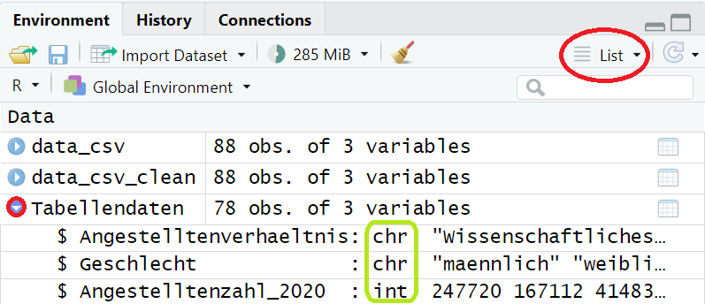

(Übung_Auswertung)=
# Übung: Auswerten von CSV-Dateien in R

## Vorwort

In der vorangegangenen Übung wurden Sie mit Ansätzen zur Organisation und Strukturierung von CSV-Dateien vertraut gemacht. Der folgende Abschnitt baut auf dem Code der letzten Übung auf und thematisiert Auswertungsmöglichkeiten von CSV-Dateien in R mit Fokus auf Untergruppierungen und Filterfunktionen.

````{admonition} Den Code für die Übung: Arbeiten mit CSV-Dateien in R finden sie hier: 
:class: tip, dropdown
```
#TidyVerse Package Installation
install.packages("tidyverse")
library(tidyverse)

#Daten einlesen
data_csv_clean <- read.csv2("21341-0001_F_2020.csv", header = FALSE, encoding = "latin1")

#Ergebnisse ansehen
head(data_csv_clean)

#Umlaute entfernen
data_csv_clean$V1 <- str_replace_all(data_csv_clean$V1, c("ä" = "ae", "ö" = "oe", "ü" ="ue", "ß" ="ss"))
data_csv_clean$V2 <- str_replace_all(data_csv_clean$V2, c("ä" = "ae", "ö" = "oe", "ü" ="ue", "ß" ="ss"))

#Ausgewählte Ergebnisse ansehen
show(data_csv_clean[8:20,1:3])

#Tabelle unterteilen
Metadaten <- data_csv_clean[c(1:6, 87:88), 1]
Tabellendaten <- data_csv_clean[8:85, 1:3]

#Spaltenüberschriften setzen
colnames(Tabellendaten) <- c("Angestelltenverhaeltnis", "Geschlecht", "Angestelltenzahl_2020")

#Nummerierung neu setzen
row.names(Tabellendaten) <- 1:78

#Ergebnis ansehen
head(Tabellendaten) 
```
````

## Variablenklassen bestimmen 

Damit Sie Ihre Daten adäquat auswerten können, müssen Sie sich über die
Struktur und Klasse der Variablen bewusst sein.  

**Die wichtigsten Variablenklassen im Überblick:**  

-   `integer`: Ganze Zahlen.  
    Beispiel: 1, 2, 5.

-   `numeric`: Zahl mit Kommastellen.  
    Beispiel: 1.99, 2.33, 5.00.

-   `character`: Zeichenketten bzw. Strings.  
    Beispiel: “Hallo”, “Apfel”, “Hannah”.

-   `factor`: Kategoriale Variablen.  
    Beispiel: “schlecht”, “gut”, “sehr gut”

Die Variablenklasse ist ausschlaggebend dafür, wie Sie die
Variablendaten auswerten können. Beispielsweise können Sie mit einer
`numeric`-Variable rechnen, mit einer `character`-Variable jedoch
nicht.  
  
**Variablenklassen bestimmen im Code:**  
Der Befehl `class()` gibt uns die jeweilige Klasse des Objektes wieder:  
```
class(Tabellendaten$Angestelltenverhaeltnis) #sollte als character oder factor gelesen werden
```
```
## [1] "character"
```
```
class(Tabellendaten$Geschlecht) #sollte als character oder factor gelesen werden
```
```
## [1] "character"
```
```
class(Tabellendaten$Angestelltenzahl_2020) #sollte als numerisch oder integer gelesen werden
```
```
## [1] "character"
```
Die Variablenklassen für “Angestelltenverhaeltnis” und “Geschlecht” sind
passend. Die Variable “Angestelltenzahl_2020” wird jedoch auch als
`character` interpretiert. Dies muss manuell geändert werden, da sonst
bestimmte Auswertungen nicht möglich sind und Fehler entstehen können.  

`````{admonition} Tipp
:class: tip
Im *Environment* Fenster können Sie die Variablenklassen ebenfalls schnell einsehen.
`````
  
  
*Abbildung 7: Environment-Fenster in RStudio*  

**Fallbeispiel:** Betrachten Sie die Funktion `max()`, welche den
Maximalwert in der jeweiligen Spalte zurückgeben soll. Hinweis:
`na.rm = TRUE` muss hinzugefügt werden, damit die nicht vorhandenen
Werte nicht berücksichtigt werden, ansonsten kommt es zu einem Error.  
```
max(Tabellendaten$Angestelltenzahl_2020, na.rm = TRUE)
```
```
## [1] "99730"
```
Wenn Sie jedoch einen Blick in die Tabelle werfen, sehen Sie schnell,
dass es mehrere Angestelltenzahlen über 100.000 gibt. Die ausgegebene
Zahl kann also nicht stimmen!  

**Wie kann es zu solch einem Fehler kommen?**  
Da die Variable “Angestelltenzahl\_2020” als `character` interpretiert
wird, ändert sich auch die Bedeutung der Funktion `max()`. Die Funkion
`max()` gibt nun nicht mehr den Maximalwert zurück, sondern den
niedrigsten Platz in alphabetischer Sortierung. Nur wenn wenn die Werte
in der Tabelle auch als Zahlen (also numerisch/integer) von **R**
gelesen werden, gibt die Funktion `max()` den Maximalwert der Spalte
zurück.  
  
  
(Variablenklasse)=
## Variablenklasse ändern 

Hierfür überspeichern Sie die Daten der jeweiligen Spalte mit den exakt
selben Daten, nur das Sie durch den Befehl `as.integer` die Klasse der
Variable ändern. Wenn Sie die Klasse in numerisch ändern wollen, würden
Sie `as.numeric` verwenden.  
```
Tabellendaten$Angestelltenzahl_2020 <- as.integer(Tabellendaten$Angestelltenzahl_2020)
```
Überprüfen Sie gegebenenfalls erneut die Klasse:
```
class(Tabellendaten$Angestelltenzahl_2020)
```
```
## [1] "integer"
```
Wenn Sie nun noch einmal die Beispielfunktion `max()` heranziehen, dann
bekommen Sie jetzt durch neuer Klassenzugehörigkeit der Variable den
Maximalwert angezeigt:
```
max(Tabellendaten$Angestelltenzahl_2020, na.rm = TRUE)
```
```
## [1] 759065
```


`````{admonition} Wichtig!
Überprüfen Sie immer die Art der Variablenklasse, welche **R** Ihren Daten zuweist und ändern Sie dies gegebenenfalls, um Fehler zu vermeiden.
`````

## Variablen hinzufügen 

Eine gute **Kategorisierung** Ihrer Daten ist notwendig, um effizient zu
filtern. Hierzu müssen Sie die Struktur der Daten nachvollziehen
können.  
Um die einzelnen Ausprägung der Variable “Angestelltenverhaeltnis” zu
sichten, bietet Ihnen **R** den Befehl `unique()`:
```
unique(Tabellendaten$Angestelltenverhaeltnis)
```
```
    ##  [1] "Wissenschaftliches und kuenstlerisches Personal"     
    ##  [2] "  Hauptberufl. wissenschaftl. u. kuenstler. Personal"
    ##  [3] "    Professoren"                                     
    ##  [4] "    Dozenten und Assistenten"                        
    ##  [5] "    Wissenschaftliche und kuenstlerische Mitarbeiter"
    ##  [6] "    Lehrkraefte fuer besondere Aufgaben"             
    ##  [7] "  Nebenberufl. wissenschaftl. u. kuenstler. Personal"
    ##  [8] "    Gastprofessoren, Emeriti"                        
    ##  [9] "    Lehrbeauftragte"                                 
    ## [10] "    Wissenschaftliche Hilfskraefte"                  
    ## [11] "Verwaltungs-, technisches und sonstiges Personal"    
    ## [12] "  Hauptberufl. Verwaltungs-, techn. u.sonst.Personal"
    ## [13] "    Verwaltungspersonal"                             
    ## [14] "    Bibliothekspersonal"                             
    ## [15] "    Technisches Personal"                            
    ## [16] "    Sonstiges Personal"                              
    ## [17] "    Pflegepersonal"                                  
    ## [18] "    Arbeiter"                                        
    ## [19] "    Auszubildende"                                   
    ## [20] "    Praktikanten"                                    
    ## [21] "    Sonstiges Personal fuer Lehre und Forschung"     
    ## [22] "    Leitungs- und Verwaltungspersonal"               
    ## [23] "  Nebenberufl. Verwaltungs-, techn. u.sonst.Personal"
    ## [24] "    Sonstige Hilfskraefte"                           
    ## [25] "    Zeitweilig Beschaeftigte"                        
    ## [26] "Insgesamt"
```

Wie Sie erkennen können, ist die Variable “Angestelltenverhaeltnis”
recht unübersichtlich, da sie verschiedene Unterkategorien enthält. Bei
Betrachtung der einzelnen Positionen ist jedoch nicht erkennbar, zu
welcher Überkategorie die Position gehört.  

**Bei genauerer Betrachtung der Tabelle fällt auf, dass es drei Ebenen
gibt:**

1.  Ebene: “Wissenschaftliches und kuenstlerisches Personal” und
    “Verwaltungs-, technisches und sonstiges Personal”  

2.  Ebene: “Hauptberuflich” und “Nebenberuflich”

3.  Ebene: Die einzelnen Positionen der Berufsbezeichnungen z.B.
    “Professoren”, “Dozenten und Assistenten”, etc.

Für eine übersichtlichere Struktur in der Tabelle, kann für die ersten
zwei Ebenen jeweils eine neue Variable erstellt werden. Hierdurch werden
zwei neue Spalten zur Tabelle hinzugefügt und Sie können dann bei
Betrachtung einer einzelnen Zeile alle wichtigen Informationen
herauslesen, was derzeit nicht möglich ist.  
  
**Neue Variablen erstellen**:  
Da die Struktur es nicht erlaubt, die neuen Variablen durch Referenz auf
die bereits vorhandenen Variablen zu erzeugen, müssen die neuen
Variablen manuell strukturiert werden.  

Erzeugen Sie hierfür zunächst neue Variablen und setzen Sie den Inhalt
erst mal auf unbekannt (NA).
```
#1.Ebene: Neue Variable "Personalkategorie"
Tabellendaten$Personalkategorie <- c(NA)
```
```
#2.Ebene: Neue Variable "Art der Anstellung"
Tabellendaten$Art_der_Anstellung <- c(NA)
```
Der Spalteninhalt muss nun manuell eingetragen werden.  
Achtung: Diese Weise ist leider recht fehleranfällig, ist jedoch durch
den Aufbau der Datei, ohne komplexere Funktionen zu benutzen, nicht
anders möglich.  


```{admonition} Wichtig!
Wenn Sie Daten generieren, strukturieren Sie diese immer gut. Dies erleichtert Ihnen selbst, aber auch allen anderen, die Ihre Daten verwenden, das Arbeiten! Eine gute Struktur von Daten liefert der Tidy-Data Ansatz (s. Kapitel [Tidy Data](Tidy_data)).
```
 
**Einpflegen des Variableninhalts**
```
#1.Ebene
Tabellendaten$Personalkategorie[76:78] <- "Insgesamt"
Tabellendaten$Personalkategorie[1:30] <- "Wissenschaftliches und künstlerisches Personal"
Tabellendaten$Personalkategorie[31:75] <- "Verwaltungs-, technisches und sonstiges Personal"
```
```
#2.Ebene
Tabellendaten$Art_der_Anstellung[c(1:3, 31:33, 76:78)] <- "Insgesamt"
Tabellendaten$Art_der_Anstellung[c(4:18,34:66)] <- "Hauptberuflich"
Tabellendaten$Art_der_Anstellung[c(19:30,67:75)] <- "Nebenberuflich"
```

Ergebnis ansehen:
```
show(Tabellendaten)
```
```
    ##                                 Angestelltenverhaeltnis Geschlecht
    ## 1       Wissenschaftliches und kuenstlerisches Personal  maennlich
    ## 2       Wissenschaftliches und kuenstlerisches Personal   weiblich
    ## 3       Wissenschaftliches und kuenstlerisches Personal  Insgesamt
    ## 4    Hauptberufl. wissenschaftl. u. kuenstler. Personal  maennlich
    ## 5    Hauptberufl. wissenschaftl. u. kuenstler. Personal   weiblich
    ## 6    Hauptberufl. wissenschaftl. u. kuenstler. Personal  Insgesamt
    ## 7                                           Professoren  maennlich
    ## 8                                           Professoren   weiblich
    ## 9                                           Professoren  Insgesamt
    ## 10                             Dozenten und Assistenten  maennlich
    ## 11                             Dozenten und Assistenten   weiblich
    ## 12                             Dozenten und Assistenten  Insgesamt
    ## 13     Wissenschaftliche und kuenstlerische Mitarbeiter  maennlich
    ## 14     Wissenschaftliche und kuenstlerische Mitarbeiter   weiblich
    ## 15     Wissenschaftliche und kuenstlerische Mitarbeiter  Insgesamt
    ## 16                  Lehrkraefte fuer besondere Aufgaben  maennlich
    ## 17                  Lehrkraefte fuer besondere Aufgaben   weiblich
    ## 18                  Lehrkraefte fuer besondere Aufgaben  Insgesamt
    ## 19   Nebenberufl. wissenschaftl. u. kuenstler. Personal  maennlich
    ## 20   Nebenberufl. wissenschaftl. u. kuenstler. Personal   weiblich
    ## 21   Nebenberufl. wissenschaftl. u. kuenstler. Personal  Insgesamt
    ## 22                             Gastprofessoren, Emeriti  maennlich
    ## 23                             Gastprofessoren, Emeriti   weiblich
    ## 24                             Gastprofessoren, Emeriti  Insgesamt
    ## 25                                      Lehrbeauftragte  maennlich
    ## 26                                      Lehrbeauftragte   weiblich
    ## 27                                      Lehrbeauftragte  Insgesamt
    ## 28                       Wissenschaftliche Hilfskraefte  maennlich
    ## 29                       Wissenschaftliche Hilfskraefte   weiblich
    ## 30                       Wissenschaftliche Hilfskraefte  Insgesamt
    ## 31     Verwaltungs-, technisches und sonstiges Personal  maennlich
    ## 32     Verwaltungs-, technisches und sonstiges Personal   weiblich
    ## 33     Verwaltungs-, technisches und sonstiges Personal  Insgesamt
    ## 34   Hauptberufl. Verwaltungs-, techn. u.sonst.Personal  maennlich
    ## 35   Hauptberufl. Verwaltungs-, techn. u.sonst.Personal   weiblich
    ## 36   Hauptberufl. Verwaltungs-, techn. u.sonst.Personal  Insgesamt
    ## 37                                  Verwaltungspersonal  maennlich
    ## 38                                  Verwaltungspersonal   weiblich
    ## 39                                  Verwaltungspersonal  Insgesamt
    ## 40                                  Bibliothekspersonal  maennlich
    ## 41                                  Bibliothekspersonal   weiblich
    ## 42                                  Bibliothekspersonal  Insgesamt
    ## 43                                 Technisches Personal  maennlich
    ## 44                                 Technisches Personal   weiblich
    ## 45                                 Technisches Personal  Insgesamt
    ## 46                                   Sonstiges Personal  maennlich
    ## 47                                   Sonstiges Personal   weiblich
    ## 48                                   Sonstiges Personal  Insgesamt
    ## 49                                       Pflegepersonal  maennlich
    ## 50                                       Pflegepersonal   weiblich
    ## 51                                       Pflegepersonal  Insgesamt
    ## 52                                             Arbeiter  maennlich
    ## 53                                             Arbeiter   weiblich
    ## 54                                             Arbeiter  Insgesamt
    ## 55                                        Auszubildende  maennlich
    ## 56                                        Auszubildende   weiblich
    ## 57                                        Auszubildende  Insgesamt
    ## 58                                         Praktikanten  maennlich
    ## 59                                         Praktikanten   weiblich
    ## 60                                         Praktikanten  Insgesamt
    ## 61          Sonstiges Personal fuer Lehre und Forschung  maennlich
    ## 62          Sonstiges Personal fuer Lehre und Forschung   weiblich
    ## 63          Sonstiges Personal fuer Lehre und Forschung  Insgesamt
    ## 64                    Leitungs- und Verwaltungspersonal  maennlich
    ## 65                    Leitungs- und Verwaltungspersonal   weiblich
    ## 66                    Leitungs- und Verwaltungspersonal  Insgesamt
    ## 67   Nebenberufl. Verwaltungs-, techn. u.sonst.Personal  maennlich
    ## 68   Nebenberufl. Verwaltungs-, techn. u.sonst.Personal   weiblich
    ## 69   Nebenberufl. Verwaltungs-, techn. u.sonst.Personal  Insgesamt
    ## 70                                Sonstige Hilfskraefte  maennlich
    ## 71                                Sonstige Hilfskraefte   weiblich
    ## 72                                Sonstige Hilfskraefte  Insgesamt
    ## 73                             Zeitweilig Beschaeftigte  maennlich
    ## 74                             Zeitweilig Beschaeftigte   weiblich
    ## 75                             Zeitweilig Beschaeftigte  Insgesamt
    ## 76                                            Insgesamt  maennlich
    ## 77                                            Insgesamt   weiblich
    ## 78                                            Insgesamt  Insgesamt
    ##    Angestelltenzahl_2020                                Personalkategorie Art_der_Anstellung
    ## 1                 247720   Wissenschaftliches und künstlerisches Personal          Insgesamt
    ## 2                 167112   Wissenschaftliches und künstlerisches Personal          Insgesamt
    ## 3                 414832   Wissenschaftliches und künstlerisches Personal          Insgesamt
    ## 4                 159567   Wissenschaftliches und künstlerisches Personal     Hauptberuflich
    ## 5                 109708   Wissenschaftliches und künstlerisches Personal     Hauptberuflich
    ## 6                 269275   Wissenschaftliches und künstlerisches Personal     Hauptberuflich
    ## 7                  36344   Wissenschaftliches und künstlerisches Personal     Hauptberuflich
    ## 8                  12949   Wissenschaftliches und künstlerisches Personal     Hauptberuflich
    ## 9                  49293   Wissenschaftliches und künstlerisches Personal     Hauptberuflich
    ## 10                  2182   Wissenschaftliches und künstlerisches Personal     Hauptberuflich
    ## 11                  1546   Wissenschaftliches und künstlerisches Personal     Hauptberuflich
    ## 12                  3728   Wissenschaftliches und künstlerisches Personal     Hauptberuflich
    ## 13                116004   Wissenschaftliches und künstlerisches Personal     Hauptberuflich
    ## 14                 89383   Wissenschaftliches und künstlerisches Personal     Hauptberuflich
    ## 15                205387   Wissenschaftliches und künstlerisches Personal     Hauptberuflich
    ## 16                  5037   Wissenschaftliches und künstlerisches Personal     Hauptberuflich
    ## 17                  5830   Wissenschaftliches und künstlerisches Personal     Hauptberuflich
    ## 18                 10867   Wissenschaftliches und künstlerisches Personal     Hauptberuflich
    ## 19                 88153   Wissenschaftliches und künstlerisches Personal     Nebenberuflich
    ## 20                 57404   Wissenschaftliches und künstlerisches Personal     Nebenberuflich
    ## 21                145557   Wissenschaftliches und künstlerisches Personal     Nebenberuflich
    ## 22                  1534   Wissenschaftliches und künstlerisches Personal     Nebenberuflich
    ## 23                   259   Wissenschaftliches und künstlerisches Personal     Nebenberuflich
    ## 24                  1793   Wissenschaftliches und künstlerisches Personal     Nebenberuflich
    ## 25                 64492   Wissenschaftliches und künstlerisches Personal     Nebenberuflich
    ## 26                 35238   Wissenschaftliches und künstlerisches Personal     Nebenberuflich
    ## 27                 99730   Wissenschaftliches und künstlerisches Personal     Nebenberuflich
    ## 28                 22127   Wissenschaftliches und künstlerisches Personal     Nebenberuflich
    ## 29                 21907   Wissenschaftliches und künstlerisches Personal     Nebenberuflich
    ## 30                 44034   Wissenschaftliches und künstlerisches Personal     Nebenberuflich
    ## 31                100320 Verwaltungs-, technisches und sonstiges Personal          Insgesamt
    ## 32                243913 Verwaltungs-, technisches und sonstiges Personal          Insgesamt
    ## 33                344233 Verwaltungs-, technisches und sonstiges Personal          Insgesamt
    ## 34                 98247 Verwaltungs-, technisches und sonstiges Personal     Hauptberuflich
    ## 35                240419 Verwaltungs-, technisches und sonstiges Personal     Hauptberuflich
    ## 36                338666 Verwaltungs-, technisches und sonstiges Personal     Hauptberuflich
    ## 37                 25941 Verwaltungs-, technisches und sonstiges Personal     Hauptberuflich
    ## 38                 83918 Verwaltungs-, technisches und sonstiges Personal     Hauptberuflich
    ## 39                109859 Verwaltungs-, technisches und sonstiges Personal     Hauptberuflich
    ## 40                  2443 Verwaltungs-, technisches und sonstiges Personal     Hauptberuflich
    ## 41                  7308 Verwaltungs-, technisches und sonstiges Personal     Hauptberuflich
    ## 42                  9751 Verwaltungs-, technisches und sonstiges Personal     Hauptberuflich
    ## 43                 33025 Verwaltungs-, technisches und sonstiges Personal     Hauptberuflich
    ## 44                 26360 Verwaltungs-, technisches und sonstiges Personal     Hauptberuflich
    ## 45                 59385 Verwaltungs-, technisches und sonstiges Personal     Hauptberuflich
    ## 46                 14422 Verwaltungs-, technisches und sonstiges Personal     Hauptberuflich
    ## 47                 41609 Verwaltungs-, technisches und sonstiges Personal     Hauptberuflich
    ## 48                 56031 Verwaltungs-, technisches und sonstiges Personal     Hauptberuflich
    ## 49                 15427 Verwaltungs-, technisches und sonstiges Personal     Hauptberuflich
    ## 50                 63731 Verwaltungs-, technisches und sonstiges Personal     Hauptberuflich
    ## 51                 79158 Verwaltungs-, technisches und sonstiges Personal     Hauptberuflich
    ## 52                    NA Verwaltungs-, technisches und sonstiges Personal     Hauptberuflich
    ## 53                    NA Verwaltungs-, technisches und sonstiges Personal     Hauptberuflich
    ## 54                    NA Verwaltungs-, technisches und sonstiges Personal     Hauptberuflich
    ## 55                  6284 Verwaltungs-, technisches und sonstiges Personal     Hauptberuflich
    ## 56                 16137 Verwaltungs-, technisches und sonstiges Personal     Hauptberuflich
    ## 57                 22421 Verwaltungs-, technisches und sonstiges Personal     Hauptberuflich
    ## 58                   705 Verwaltungs-, technisches und sonstiges Personal     Hauptberuflich
    ## 59                  1356 Verwaltungs-, technisches und sonstiges Personal     Hauptberuflich
    ## 60                  2061 Verwaltungs-, technisches und sonstiges Personal     Hauptberuflich
    ## 61                    NA Verwaltungs-, technisches und sonstiges Personal     Hauptberuflich
    ## 62                    NA Verwaltungs-, technisches und sonstiges Personal     Hauptberuflich
    ## 63                    NA Verwaltungs-, technisches und sonstiges Personal     Hauptberuflich
    ## 64                    NA Verwaltungs-, technisches und sonstiges Personal     Hauptberuflich
    ## 65                    NA Verwaltungs-, technisches und sonstiges Personal     Hauptberuflich
    ## 66                    NA Verwaltungs-, technisches und sonstiges Personal     Hauptberuflich
    ## 67                  2073 Verwaltungs-, technisches und sonstiges Personal     Nebenberuflich
    ## 68                  3494 Verwaltungs-, technisches und sonstiges Personal     Nebenberuflich
    ## 69                  5567 Verwaltungs-, technisches und sonstiges Personal     Nebenberuflich
    ## 70                  2073 Verwaltungs-, technisches und sonstiges Personal     Nebenberuflich
    ## 71                  3494 Verwaltungs-, technisches und sonstiges Personal     Nebenberuflich
    ## 72                  5567 Verwaltungs-, technisches und sonstiges Personal     Nebenberuflich
    ## 73                    NA Verwaltungs-, technisches und sonstiges Personal     Nebenberuflich
    ## 74                    NA Verwaltungs-, technisches und sonstiges Personal     Nebenberuflich
    ## 75                    NA Verwaltungs-, technisches und sonstiges Personal     Nebenberuflich
    ## 76                348040                                        Insgesamt          Insgesamt
    ## 77                411025                                        Insgesamt          Insgesamt
    ## 78                759065                                        Insgesamt          Insgesamt
 ```


## Unterkategorisieren 

Eine Unterkategorisierung (auch Sub-Sampling gennant) bietet sich auch
insbesondere für die Variable “Geschlecht” an.
```
unique(Tabellendaten$Geschlecht)
```
```
## [1] "maennlich" "weiblich"  "Insgesamt"
```
Durch das Aufführen der Variablenausprägung `"Insgesamt"` wird die
Tabelle recht unübersichtlich. Es empfiehlt sich das sub-samplen der
Tabelle nach den verschiedenen Geschlechtsausprägungen:
```
#Geschlecht
Tabelle_maennlich <- subset(Tabellendaten, Geschlecht == "maennlich")
Tabelle_weiblich <- subset(Tabellendaten, Geschlecht == "weiblich")
Tabelle_Insgesamt <- subset(Tabellendaten, Geschlecht == "Insgesamt")
```
```
#Ergbnis ansehen 
head(Tabelle_Insgesamt)
```
```
    ##                                 Angestelltenverhaeltnis Geschlecht Angestelltenzahl_2020                              Personalkategorie Art_der_Anstellung
    ## 3       Wissenschaftliches und kuenstlerisches Personal  Insgesamt                414832 Wissenschaftliches und künstlerisches Personal          Insgesamt
    ## 6    Hauptberufl. wissenschaftl. u. kuenstler. Personal  Insgesamt                269275 Wissenschaftliches und künstlerisches Personal     Hauptberuflich
    ## 9                                           Professoren  Insgesamt                 49293 Wissenschaftliches und künstlerisches Personal     Hauptberuflich
    ## 12                             Dozenten und Assistenten  Insgesamt                  3728 Wissenschaftliches und künstlerisches Personal     Hauptberuflich
    ## 15     Wissenschaftliche und kuenstlerische Mitarbeiter  Insgesamt                205387 Wissenschaftliches und künstlerisches Personal     Hauptberuflich
    ## 18                  Lehrkraefte fuer besondere Aufgaben  Insgesamt                 10867 Wissenschaftliches und künstlerisches Personal     Hauptberuflich
```
  
Wenn Sie nun z.B. aus der *Tabelle\_Insgesamt* die zweite Spalte entfernen
möchten, da diese redundant ist, können Sie die Spalte aus dem Subsample
entfernen:
```
Tabelle_Insgesamt <- subset(Tabelle_Insgesamt, select= c(-Geschlecht))
```
```
#Ergebnis ansehen
head(Tabelle_Insgesamt)
```
```
    ##                                 Angestelltenverhaeltnis Angestelltenzahl_2020                              Personalkategorie  Art_der_Anstellung
    ## 3       Wissenschaftliches und kuenstlerisches Personal                414832 Wissenschaftliches und künstlerisches Personal           Insgesamt
    ## 6    Hauptberufl. wissenschaftl. u. kuenstler. Personal                269275 Wissenschaftliches und künstlerisches Personal      Hauptberuflich
    ## 9                                           Professoren                 49293 Wissenschaftliches und künstlerisches Personal      Hauptberuflich
    ## 12                             Dozenten und Assistenten                  3728 Wissenschaftliches und künstlerisches Personal      Hauptberuflich
    ## 15     Wissenschaftliche und kuenstlerische Mitarbeiter                205387 Wissenschaftliches und künstlerisches Personal      Hauptberuflich
    ## 18                  Lehrkraefte fuer besondere Aufgaben                 10867 Wissenschaftliches und künstlerisches Personal      Hauptberuflich
``` 
  

## Tabellendaten filtern 

Alternativ zum `subset`-Befehl kann mit dem Befehl `filter` gearbeitet
werden.  
Damit können Sie Ihre Tabelle filtern und sich gezielt Inhalte anzeigen lassen.  
  
Hierzu können Sie verschiedene Operatoren und Funktionen nutzen:  
  
**Mathematische Operatoren:**

-   `==` (Ist gleich)
-   `!=` (Ist nicht gleich)
-   `<` (Kleiner als)
-   `<=` (Kleiner-Gleich)
-   `>` (Größer als)
-   `>=` (Größer-Gleich)

Beispiel:
```
filter(Tabelle_Insgesamt, Tabelle_Insgesamt$Angestelltenzahl_2020 <= 5000)
```
```
    ##        Angestelltenverhaeltnis Angestelltenzahl_2020                                Personalkategorie Art_der_Anstellung
    ## 1     Dozenten und Assistenten                  3728   Wissenschaftliches und künstlerisches Personal     Hauptberuflich
    ## 2     Gastprofessoren, Emeriti                  1793   Wissenschaftliches und künstlerisches Personal     Nebenberuflich
    ## 3                 Praktikanten                  2061 Verwaltungs-, technisches und sonstiges Personal     Hauptberuflich
```
  
**Logische Operatoren:**

-   `!` (logisches NICHT)
-   `&` (logisches UND)
-   `|` (logisches ODER)

Beispiel:
```
filter(Tabellendaten, Tabellendaten$Personalkategorie == "Wissenschaftliches und künstlerisches Personal" & Tabellendaten$Geschlecht == "weiblich" )
```
```
    ##                                 Angestelltenverhaeltnis Geschlecht Angestelltenzahl_2020 			     Personalkategorie Art_der_Anstellung
    ## 1       Wissenschaftliches und kuenstlerisches Personal   weiblich 		 167112 Wissenschaftliches und künstlerisches Personal 	    	Insgesamt
    ## 2    Hauptberufl. wissenschaftl. u. kuenstler. Personal   weiblich 		 109708 Wissenschaftliches und künstlerisches Personal 	   Hauptberuflich
    ## 3                                           Professoren   weiblich		  12949 Wissenschaftliches und künstlerisches Personal 	   Hauptberuflich
    ## 4                              Dozenten und Assistenten   weiblich 		   1546 Wissenschaftliches und künstlerisches Personal 	   Hauptberuflich
    ## 5      Wissenschaftliche und kuenstlerische Mitarbeiter   weiblich 		  89383 Wissenschaftliches und künstlerisches Personal 	   Hauptberuflich
    ## 6                   Lehrkraefte fuer besondere Aufgaben   weiblich 		   5830 Wissenschaftliches und künstlerisches Personal 	   Hauptberuflich
    ## 7    Nebenberufl. wissenschaftl. u. kuenstler. Personal   weiblich 		  57404 Wissenschaftliches und künstlerisches Personal 	   Hauptberuflich
    ## 8                              Gastprofessoren, Emeriti   weiblich 		    259 Wissenschaftliches und künstlerisches Personal 	   Hauptberuflich
    ## 9                                       Lehrbeauftragte   weiblich 		  35238 Wissenschaftliches und künstlerisches Personal 	   Hauptberuflich
    ## 10                       Wissenschaftliche Hilfskraefte   weiblich 		  21907 Wissenschaftliches und künstlerisches Personal 	   Hauptberuflich
```
  
**Verwenden von Funktionen:**

Beispiel: Ausgabe des kleinsten Wertes mittels der `min()`-Funktion
```
filter(Tabellendaten, Tabellendaten$Angestelltenzahl_2020 == min(Tabellendaten$Angestelltenzahl_2020, na.rm = TRUE))
```
```
    ##        Angestelltenverhaeltnis Geschlecht Angestelltenzahl_2020 				    Personalkategorie Art_der_Anstellung
    ## 1     Gastprofessoren, Emeriti   weiblich                   259 Wissenschaftliches und künstlerisches Personal     Nebenberuflich
```
  
**Mögliche Probleme?**

Wenn mit der Variable `Angestelltenverhaeltnis` gefiltert werden soll, gibt **R** folgenden Output:
```
#Beispiel: Filtern nach "Professoren"
filter(Tabellendaten, Tabellendaten$Angestelltenverhaeltnis == "Professoren")
```
```
##1     Angestelltenverhaeltnis Geschlecht Angestelltenzahl_2020 Personalkategorie Art_der_Anstellung  
	<0 Zeilen> (oder row.names mit Länge 0)
```
Wenn Sie jedoch in den Datensatz schauen, sehen Sie, dass Professoren unter `Angestelltenverhaeltnis` mit aufgelistet werden. 

**Warum werden "Professoren" nicht gefunden?**\
Das Problem besteht darin, dass die Ausgangsdatei Leerzeichen vor dem Wort Professoren (und auch vor anderen Bezeichnungen von Angestelltenverhältnissen) enthält.

Mit dem Befehl `trimws()` können Sie die vorgestellten Leerzeichen vor den Bezeichnungen entfernen:
```
Tabellendaten$Angestelltenverhaeltnis <- trimws(Tabellendaten$Angestelltenverhaeltnis)
```

Führen Sie nun erneut die Filtersuche durch und Sie erhalten das korrekte Ergebnis:
```
filter(Tabellendaten, Tabellendaten$Angestelltenverhaeltnis == "Professoren")
```
```
##  Angestelltenverhaeltnis Geschlecht Angestelltenzahl_2020                              Personalkategorie Art_der_Anstellung
##1             Professoren   männlich                 36344 Wissenschaftliches und künstlerisches Personal     Hauptberuflich 
##2             Professoren   weiblich                 12949 Wissenschaftliches und künstlerisches Personal     Hauptberuflich
##3             Professoren  Insgesamt                 49293 Wissenschaftliches und künstlerisches Personal     Hauptberuflich
```

## Sortieren von Tabellendaten 

Sie können Tabellen mittels des `order()`-Befehls nach belieben
sortieren.  

Beispiel:
```
Tabelle_Insgesamt_Sortiert <- Tabelle_Insgesamt[order(Tabelle_Insgesamt$Angestelltenzahl_2020, decreasing = TRUE),]
```
```
#Ergebnis ansehen
head(Tabelle_Insgesamt_Sortiert)
```
```
    ##                                 Angestelltenverhaeltnis Angestelltenzahl_2020                                Personalkategorie Art_der_Anstellung
    ## 78                                            Insgesamt                759065                                        Insgesamt          Insgesamt
    ## 3       Wissenschaftliches und kuenstlerisches Personal                414832   Wissenschaftliches und künstlerisches Personal          Insgesamt
    ## 33     Verwaltungs-, technisches und sonstiges Personal                344233 Verwaltungs-, technisches und sonstiges Personal          Insgesamt
    ## 36   Hauptberufl. Verwaltungs-, techn. u.sonst.Personal                338666 Verwaltungs-, technisches und sonstiges Personal     Hauptberuflich
    ## 6    Hauptberufl. wissenschaftl. u. kuenstler. Personal                269275   Wissenschaftliches und künstlerisches Personal     Hauptberuflich
    ## 15     Wissenschaftliche und kuenstlerische Mitarbeiter                205387   Wissenschaftliches und künstlerisches Personal     Hauptberuflich
```
