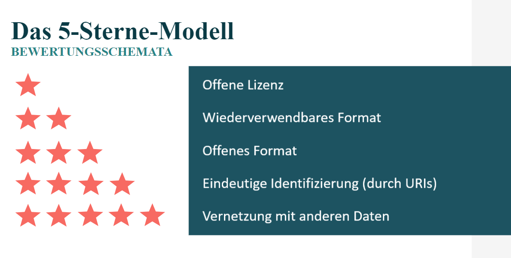

# 5-Sterne-Modell

*Abbildung 3: Eigene Abbildung basierend auf {cite}`bruns_leitfaden_2019`.*

Um die Qualität von Daten einzuschätzen, gibt es verschiedene Bewertungsschemata und -dimensionen. Während die FAIR-Prinzipien ihren Fokus in der Bewertung auf die Wiederverwendbarkeit der Daten legen, steht beim 5-Sterne-Modell die Offenheit und Interoperabilität der Daten im Vordergrund {cite}`gangemi_assessing_2018`. Die fünf Stufen sind kaskadierend, d.h. damit ein Datensatz beispielsweise eine Drei-Sterne. Bewertung erhalten kann, müssen die Stufen eins bis drei vollständig erfüllt sein {cite}`bruns_leitfaden_2019`.

Mithilfe des 5-Sterne-Modells  können folgende Einschätzung hinsichtlich des Datensatzes vorgenommen werden:

- **1 Stern** = Der erste Stern wird an Datensätze verliehen, die unter einer offenen Lizenz zur Verfügung gestellt werden, unabhängig ihrer eigentlichen Datenqualität (Bruns et al., 2019). Ein Stern bedeutet, dass der Nutzer auf die Daten zugreifen, die Daten nutzen, sie lokal speichern, bearbeiten und teilen kann {cite}`gangemi_assessing_2018`.

- **2 Sterne** = Ist der Datensatz mit zwei Sterne ausgezeichnet, handelt es sich um maschinenlesbare, strukturierte Daten (z. B. um eine Exceltabelle anstelle einer Fotokopie der Tabelle) (Al-khatib, 2021). Der Datensatz ist neben der offenen Lizenz zusätzlich leicht wiederverwendbar {cite}`bruns_leitfaden_2019`.

- **3 Sterne** = Der Datensatz erhält einen dritten Stern, wenn er in einem nicht-proprietären offenen Format zur Verfügung gestellt wird (Hasnain, 2018). Ein nicht-proprietäres Format bedeutet, dass der Datensatz unabhängig von einer spezifischen Software verwendet werden kann {cite}`bruns_leitfaden_2019`.

- **4 Sterne** = Die vierte Stufe erreicht ein Datensatz, sofern er eindeutig identifiziert wird, z.B. durch die Verwendung von URIs (Uniform Resource Identifiers). Nutzer können den Datensatz im Web oder lokal verlinken, Lesezeichen erstellen oder die Daten mit anderen Daten kombinieren {cite}`bruns_leitfaden_2019`. 

- **5 Sterne** = Ein Datensatz erreicht die letzte Stufe, wenn alle vorherigen Stufen erreicht wurden (kaskadierendes Modell). Der 5. Stern wird vergeben, wenn zusätzlich eine Verlinkung der Daten mit anderen Daten erfolgt. Diese Verlinkung ermöglicht es, den Datensatz in einen Kontext zu stellen und zwischen verschiedenen Datenpunkten zu navigieren. Nutzer können damit während der Nutzung ähnliche Daten entdecken und Informationen über das Datenschema erhalten {cite}`bruns_leitfaden_2019`.  
