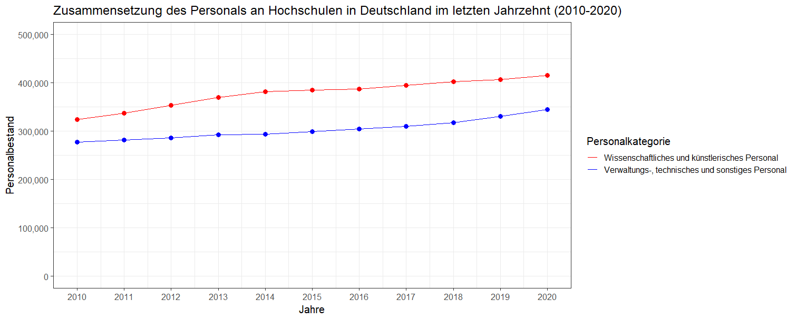

# Übung: Zeitreihe Personalentwicklung

In den vorangegangenen Übungen konnten wir verschiedene Fragen nach der Qualität der Daten und der Reproduzierbarkeit beantworten. 

Doch wie steht es eigentlich um unsere Forschungsfrage:

> Wie hat sich die Zusammensetzung des Personals an Hochschulen in Deutschland im letzten Jahrzehnt (2010-2020) entwickelt?

Um diese Frage beantworten zu können, reicht unsere Raw-Data Datei nicht aus, da diese nur die Daten für das Jahr 2020 enthält.
Das Open-Data-Portal von [Destatis](https://www-genesis.destatis.de) bietet jedoch auch die Möglichkeiten, die Daten für alle Jahre von 2010 bis 2020 herunterzuladen
oder Sie laden den Datensatz [hier](Data/21341-0001_F_2010-2020.csv) direkt aus unserem Repositorium hierunter.

## Daten vorbereiten

Die CSV Datei können Sie nun wie in dem Abschnitt 6.3. [Übung: Arbeiten mit CSV-Dateien in R](/Markdown/21_Einstieg_R.md) einlesen und in Daten und Metadaten unterteilen.

```
#Benötigtes Package zum Start der Session laden, damit alle hier verwendeteten Befehle verfügbar sind
library(tidyverse) 

#Daten einlesen
data_csv_clean <- read.csv2("21341-0001_F_2010-2020.csv", header = FALSE, encoding = "latin1")

#Datenkategorie setzten
Metadaten <- data_csv_clean[c(1:6, 87:88), 1]
Tabellendaten <- data_csv_clean[8:85, 1:13] #manuelles anpassen der zusätzlichen Spalten (Jahre 2010 bis 2019) nötig

#Zeilen neu beschriften
row.names(Tabellendaten) <- 1:78
```

Betrachten wir nun die neuen Tabellendaten:
```
head(Tabellendaten)
```
```
##                                                    V1        V2     V3     V4     V5     V6     V7     V8     V9    V10    V11    V12    V13
## 1      Wissenschaftliches und künstlerisches Personal  männlich 208268 214232 222735 230286 236561 237107 237557 241300 244186 245452 247720
## 2      Wissenschaftliches und künstlerisches Personal  weiblich 116099 122870 130955 139561 144708 148204 149195 153578 157872 161207 167112
## 3      Wissenschaftliches und künstlerisches Personal Insgesamt 324367 337102 353690 369847 381269 385311 386752 394878 402058 406659 414832
## 4   Hauptberufl. wissenschaftl. u. künstler. Personal  männlich 135125 138231 141704 145386 146556 146861 147811 151563 154020 155848 159567
## 5   Hauptberufl. wissenschaftl. u. künstler. Personal  weiblich  75424  79307  83410  87873  89808  92339  94587  97972 101522 104763 109708
## 6   Hauptberufl. wissenschaftl. u. künstler. Personal Insgesamt 210549 217538 225114 233259 236364 239200 242398 249535 255542 260611 269275
```

Für ein besseres Verständnis setzten Sie wieder eine verständliche Variablenbezeichnung (Spaltenüberschriften):
```
#Schritt 1: Objekt definieren, welches in aufsteigender Reihenfolge die Beschriftungen "Angestelltenverältns_2010" bis "Angestelltenverältns_2020" enthält.
alle_Jahre <- paste("Angestelltenzahl_",sep="", 2010:2020)

#Schritt 2: Variablenbezeichnung setzen
colnames(Tabellendaten) <- c("Angestelltenverhaeltnis", "Geschlecht", alle_Jahre)

#Tabelle anzeigen lassen 
head(Tabellendaten)
```
```
##                               Angestelltenverhaeltnis Geschlecht Angestelltenzahl_2010 Angestelltenzahl_2011 Angestelltenzahl_2012 Angestelltenzahl_2013 Angestelltenzahl_2014 Angestelltenzahl_2015 Angestelltenzahl_2016 Angestelltenzahl_2017 Angestelltenzahl_2018 Angestelltenzahl_2019 Angestelltenzahl_2020
## 1      Wissenschaftliches und künstlerisches Personal   männlich                208268                214232                222735                230286                236561                237107                237557                241300                244186                245452                247720
## 2      Wissenschaftliches und künstlerisches Personal   weiblich                116099                122870                130955                139561                144708                148204                149195                153578                157872                161207                167112
## 3      Wissenschaftliches und künstlerisches Personal  Insgesamt                324367                337102                353690                369847                381269                385311                386752                394878                402058                406659                414832
## 4   Hauptberufl. wissenschaftl. u. künstler. Personal   männlich                135125                138231                141704                145386                146556                146861                147811                151563                154020                155848                159567
## 5   Hauptberufl. wissenschaftl. u. künstler. Personal   weiblich                 75424                 79307                 83410                 87873                 89808                 92339                 94587                 97972                101522                104763                109708
## 6   Hauptberufl. wissenschaftl. u. künstler. Personal  Insgesamt                210549                217538                225114                233259                236364                239200                242398                249535                255542                260611                269275
```

Damit Sie die Tabelle im nächsten Schritt filtern können, müssen Sie wieder die unnötigen Leerzeichen mittels des `trimws()`-Befehls entfernen.

```
#Leerzeichen entfernen
Tabellendaten$Angestelltenverhaeltnis <- trimws(Tabellendaten$Angestelltenverhaeltnis)
```

Nun Sind die Daten bereit zur Auswertung.

## Gesuchte Daten finden 

In der Forschungsfrage wird von der "Zusammensetzung des Personals an deutschen Hochschulen"" gesprochen.
Nun stellt sich die Frage, welche Personalgruppen hierfür genau beleuchtet werden sollen. Damit es übersichtlich bleibt, betrachten wir im folgenden nur die zwei Übergruppen "Wissenschaftliches und künstlerisches Personal" und "Verwaltungs-, technisches und sonstiges Personal". 

Hierfür filtern wir die Tabelle nach diesen beiden Gruppen:

```
#Tabelle filtern
Daten_basis <- filter(Tabellendaten, Angestelltenverhaeltnis == "Wissenschaftliches und künstlerisches Personal"
                     & Geschlecht =="Insgesamt" | Angestelltenverhaeltnis == "Verwaltungs-, technisches und sonstiges Personal"
                     & Geschlecht =="Insgesamt")
#Ergbnis sichten                 
show(Daten_basis)
```
```
##                            Angestelltenverhaeltnis Geschlecht Angestelltenzahl_2010 Angestelltenzahl_2011 Angestelltenzahl_2012 Angestelltenzahl_2013 Angestelltenzahl_2014 Angestelltenzahl_2015 Angestelltenzahl_2016 Angestelltenzahl_2017 Angestelltenzahl_2018 Angestelltenzahl_2019 Angestelltenzahl_2020
## 1   Wissenschaftliches und künstlerisches Personal  Insgesamt                324367                337102                353690                369847                381269                385311                386752                394878                402058                406659                414832
## 2 Verwaltungs-, technisches und sonstiges Personal  Insgesamt                277315                282131                286331                292229                293877                299074                304611                309729                317145                331103                344233
```
## Daten auswerten 

Um mit Datenwerten rechnen zu können, ist die Klasse der Daten entscheidend. Was Variablenklassen genau sind wurde in dem Abschnitt [Übung: Arbeiten mit CSV-Dateien in R](/Markdown/21_Einstieg_R.md) bereits besprochen.

Mittels des Befehls `str()` können Sie sich schnell die Klassen anzeigen lassen:
```
str(Daten_basis)
```
```
'data.frame':	2 obs. of  13 variables:
 $ Angestelltenverhaeltnis: chr  "Wissenschaftliches und künstlerisches Personal" "Verwaltungs-, technisches und sonstiges Personal"
 $ Geschlecht             : chr  "Insgesamt" "Insgesamt"
 $ Angestelltenzahl_2010  : chr  324367 277315
 $ Angestelltenzahl_2011  : chr  "337102" "282131"
 $ Angestelltenzahl_2012  : chr  "353690" "286331"
 $ Angestelltenzahl_2013  : chr  "369847" "292229"
 $ Angestelltenzahl_2014  : chr  "381269" "293877"
 $ Angestelltenzahl_2015  : chr  "385311" "299074"
 $ Angestelltenzahl_2016  : chr  "386752" "304611"
 $ Angestelltenzahl_2017  : chr  "394878" "309729"
 $ Angestelltenzahl_2018  : chr  "402058" "317145"
 $ Angestelltenzahl_2019  : chr  "406659" "331103"
 $ Angestelltenzahl_2020  : chr  414832 344233
```

Im folgenden Wollen wir die Jahre 2010 und 2020 miteinander vergleichen, daher müssen Sie für diese Variablen die Klasse in integer oder numeric ändern.
```
Daten_basis$Angestelltenzahl_2010 <- as.integer(Daten_basis$Angestelltenzahl_2010)
Daten_basis$Angestelltenzahl_2020 <- as.integer(Daten_basis$Angestelltenzahl_2020)
```

##### Wie hat sich der Personalbestand zwischen den Jahren 2010 und 2020 verändert?
```
#Absolute Veränderung:
Daten_basis$Angestelltenzahl_2020 - Daten_basis$Angestelltenzahl_2010

#Prozentuale veränderung:
(Daten_basis$Angestelltenzahl_2020 - Daten_basis$Angestelltenzahl_2010) / Daten_basis$Angestelltenzahl_2010 * 100
```
```
[1] 90465 66918
```
```
[1] 27.88971 24.13068
```
**Antwort:**
Der absolute Personalbestand an deutschen Hochschulen hat sich wie folgt verändert:

- Zwischen den Jahren 2010 und 2020 hat sich der Personalbestand von *wissenschaftlichem und künstlerischem Personal* um 90.465 erhöht. Dies entspricht einer Erhöhung um 27,89 %.

- Zwischen den Jahren 2010 und 2020 hat sich der Personalbestand von *Verwaltungs-, technischem und sonstigem Personal* um 66.918 erhöht. Dies entspricht einer Erhöhung um 24,13 %.


##### Wie groß ist der prozentuale Anteil der jeweiligen Gruppe am gesamten Personalbestand?
```
#Prozentuale Zusammensetzung 2010
Daten_basis$Angestelltenzahl_2010 / sum(Daten_basis$Angestelltenzahl_2010) * 100

#Prozentuale Zusammensetzung 2020 
Daten_basis$Angestelltenzahl_2020 / sum(Daten_basis$Angestelltenzahl_2020) * 100
```
```
[1] 53.91004 46.08996
```
```
[1] 54.65039 45.34961
```
**Antwort:**
Die prozentuale Zusammensetzung des Personalbestandes an deutschen Hochschulen hat sich wie folgt verändert:

- Zwischen den Jahren 2010 und 2020 hat sich der Personalbestand von *wissenschaftlichem und künstlerischem Personal* von 53,91 % auf 54,65 % am Gesamtanteil gesteigert

- Zwischen den Jahren 2010 und 2020 hat sich der Personalbestand von *Verwaltungs-, technischem und sonstigem Personal* von 46,09 % auf 45,35 % am Gesamtanteil verringert.

## Daten visualisieren
Für eine visuelle Beantwortung unserer Forschungsfrage bietet das erstellen eines Liniendiagramms an.
Hierfür benötigen wir einen Datenframe welcher die folgenden Variablen spaltenweise auflistet:

- Jahre 2010 bis 2020
- Wissenschaftliches und künstlerisches Personal
- Verwaltungs-, technisches und sonstiges Personal


Dieser Aufbau ähnelt dem Aufbau unserer `Daten_basis`, jedoch müssen wir hierfür die Zeilen nun spaltenweise anordnen. Diesen Schritt nennt man "transponieren" (="spiegeln").

Der Befehl `t()` hilft uns hier raus:
```
Daten_basis_transponiert <- as.data.frame(t(Daten_basis))

#Ergbenis anzeigen lassen
show(Daten_basis_transponiert)
```
```
##                                                                     V1                                               V2
## Angestelltenverhaeltnis Wissenschaftliches und künstlerisches Personal Verwaltungs-, technisches und sonstiges Personal
## Geschlecht                                                   Insgesamt                                        Insgesamt
## Angestelltenzahl_2010                                           324367                                           277315
## Angestelltenzahl_2011                                           337102                                           282131
## Angestelltenzahl_2012                                           353690                                           286331
## Angestelltenzahl_2013                                           369847                                           292229
## Angestelltenzahl_2014                                           381269                                           293877
## Angestelltenzahl_2015                                           385311                                           299074
## Angestelltenzahl_2016                                           386752                                           304611
## Angestelltenzahl_2017                                           394878                                           309729
## Angestelltenzahl_2018                                           402058                                           317145
## Angestelltenzahl_2019                                           406659                                           331103
## Angestelltenzahl_2020                                           414832                                           344233
```

An dieser Stelle sind wir jetzt primär nur an den Zahlenwerten interessiert und wollen diese in einen neuen Datenframe überführen, welcher die wie oben beschrieben strukturieren erzeugt.
```
plot_daten <- data_frame(Jahre=2010:2020, Wissenschaft=Daten_basis_transponiert[3:13,1], Verwaltung=Daten_basis_transponiert[3:13,2])

#Ergebnis ansehen 
show(plot_daten)
```
```
# A tibble: 11 × 3
   Jahre Wissenschaft Verwaltung
   <int> <chr>        <chr>     
 1  2010 324367       277315    
 2  2011 337102       282131    
 3  2012 353690       286331    
 4  2013 369847       292229    
 5  2014 381269       293877    
 6  2015 385311       299074    
 7  2016 386752       304611    
 8  2017 394878       309729    
 9  2018 402058       317145    
10  2019 406659       331103    
11  2020 414832       344233 
```

Der erzeugte Datenframe entspricht nun genau der gewünschten Strukutr. Jetzt muss nur noch die Variablenklasse zu integer oder numeric geändert werden und das Liniendiagramm ist bereit, gebaut zu werden. 

```
plot_daten$Wissenschaft <- as.integer(plot_daten$Wissenschaft)
plot_daten$Verwaltung <- as.integer(plot_daten$Verwaltung)
```

Zur Visulaiserung von Daten in **R** empfiehlt sich die Verwendung der `ggplot`-Funktion und der dazugehörigen Spezifizierungen.

```
ggplot(plot_daten, aes(x = Jahre))+ #Setzen der Datenbasis und X-Achse
  geom_line(aes(y=Wissenschaft, color = "red"))+ #Linie für Varaible "Wissenschaft"" erzeugen
  geom_point(aes(y=Wissenschaft), size = 3, color = "red")+ #Punkte zur Linie hinzufügen
  geom_line(aes(y=Verwaltung, color = "blue"))+ #Linie für Varaible "Verwaltung"" erzeugen
  geom_point(aes(y=Verwaltung), size = 3, color = "blue")+ #Punkte zur Linie hinzufügen
  scale_x_continuous(breaks = 2010:2020)+ #Abschnitte für X-Achse definieren
  theme_bw(base_size = 15)+ #Layout bzw. Theme setzen
  scale_y_continuous("Personalbestand", limits=c(0,500000),labels = scales::comma)+ #Y-Achse beschriften und Wertebereich setzen.
  ggtitle("Zusammensetzung des Personals an Hochschulen in Deutschland im letzten Jahrzehnt (2010-2020)")+ #Diagrammtitel setzen
  scale_color_identity(name = "Personalkategorie",
                       breaks = c("red", "blue"),
                       labels = c("Wissenschaftliches und künstlerisches Personal", "Verwaltungs-, technisches und sonstiges Personal"),
                       guide = "legend"
                       ) #Legende setzen
```

  


In dem erzeugten Liniendiagramm lässt sich die Erhöhung des Bestandes beider Personalgruppen leicht ablesen.

````{admonition} Zur Kontrolle. Den kompletten Code der Übung finden Sie hier: 
:class: hinweis, dropdown
```
#Benötigtes Package zum Start der Session laden, damit alle hier verwendeteten Befehle verfügbar sind
library(tidyverse) 

#Daten einlesen
data_csv_clean <- read.csv2("21341-0001_F_2010-2020.csv", header = FALSE, encoding = "latin1")

#Datenkategorie setzten
Metadaten <- data_csv_clean[c(1:6, 87:88), 1]
Tabellendaten <- data_csv_clean[8:85, 1:13] #manuelles anpassen der zusätzlichen Spalten (Jahre 2010 bis 2019) nötig

#Zeilen neu beschriften
row.names(Tabellendaten) <- 1:78

#Objekt definieren, welches in aufsteigender Reihenfolge die Beschriftungen "Angestelltenverältns_2010" bis "Angestelltenverältns_2020" enthält.
alle_Jahre <- paste("Angestelltenzahl_",sep="", 2010:2020)

#Variablenbezeichnung setzen
colnames(Tabellendaten) <- c("Angestelltenverhaeltnis", "Geschlecht", alle_Jahre)

#Tabelle anzeigen lassen 
head(Tabellendaten)

#Leerzeichen entfernen
Tabellendaten$Angestelltenverhaeltnis <- trimws(Tabellendaten$Angestelltenverhaeltnis)

#Tabelle filtern
Daten_basis <- filter(Tabellendaten, Angestelltenverhaeltnis == "Wissenschaftliches und künstlerisches Personal"
                      & Geschlecht =="Insgesamt" | Angestelltenverhaeltnis == "Verwaltungs-, technisches und sonstiges Personal"
                      & Geschlecht =="Insgesamt")
#Ergbnis sichten                 
show(Daten_basis)

#Klassen anzeigen um Daten auszuwerten
str(Daten_basis)

#Variablenklassen un integer ändern
Daten_basis$Angestelltenzahl_2010 <- as.integer(Daten_basis$Angestelltenzahl_2010)
Daten_basis$Angestelltenzahl_2020 <- as.integer(Daten_basis$Angestelltenzahl_2020)

#Absolute Veränderung:
Daten_basis$Angestelltenzahl_2020 - Daten_basis$Angestelltenzahl_2010

#Prozentuale veränderung:
(Daten_basis$Angestelltenzahl_2020 - Daten_basis$Angestelltenzahl_2010) / Daten_basis$Angestelltenzahl_2010 * 100

#Prozentuale Zusammensetzung 2010
Daten_basis$Angestelltenzahl_2010 / sum(Daten_basis$Angestelltenzahl_2010) * 100

#Prozentuale Zusammensetzung 2020 
Daten_basis$Angestelltenzahl_2020 / sum(Daten_basis$Angestelltenzahl_2020) * 100

#Tabelle transponieren
Daten_basis_transponiert <- as.data.frame(t(Daten_basis))

#Ergbenis anzeigen lassen
show(Daten_basis_transponiert)

#Zahlenwerte in Datenframe überführen
plot_daten <- data_frame(Jahre=2010:2020, Wissenschaft=Daten_basis_transponiert[3:13,1], Verwaltung=Daten_basis_transponiert[3:13,2])

#Variablenklasse wechseln
plot_daten$Wissenschaft <- as.integer(plot_daten$Wissenschaft)
plot_daten$Verwaltung <- as.integer(plot_daten$Verwaltung)

#Visualisierung der Daten mittels ggplot
ggplot(plot_daten, aes(x = Jahre))+ #Setzen der Datenbasis und X-Achse
  geom_line(aes(y=Wissenschaft, color = "red"))+ #Linie für Varaible "Wissenschaft"" erzeugen
  geom_point(aes(y=Wissenschaft), size = 3, color = "red")+ #Punkte zur Linie hinzufügen
  geom_line(aes(y=Verwaltung, color = "blue"))+ #Linie für Varaible "Verwaltung"" erzeugen
  geom_point(aes(y=Verwaltung), size = 3, color = "blue")+ #Punkte zur Linie hinzufügen
  scale_x_continuous(breaks = 2010:2020)+ #Abschnitte für X-Achse definieren
  theme_bw(base_size = 15)+ #Layout bzw. Theme setzen
  scale_y_continuous("Personalbestand", limits=c(0,500000),labels = scales::comma)+ #Y-Achse beschriften und Wertebereich setzen.
  ggtitle("Zusammensetzung des Personals an Hochschulen in Deutschland im letzten Jahrzehnt (2010-2020)")+ #Diagrammtitel setzen
  scale_color_identity(name = "Personalkategorie",
                       breaks = c("red", "blue"),
                       labels = c("Wissenschaftliches und künstlerisches Personal", "Verwaltungs-, technisches und sonstiges Personal"),
                       guide = "legend"
  ) #Legende setzen
```
````

Zuletzt bleibt nun nur noch eine zusammenfassende Antwort auf unsere Forschungsfrage aus.

> Wie hat sich die Zusammensetzung des Personals an Hochschulen in Deutschland im letzten Jahrzehnt (2010-2020) entwickelt?

`````{admonition} Antwort
:class: solution
Das Personal an Hochschulen in Deutschland gliedert sich in zwei Hauptgruppen:

- 1. Wissenschaftliches und künstlerisches Personal
- 2. Verwaltungs-, technisches und sonstiges Personal

Beide Personalgruppen haben Sie zwischen den Jahren 2010 und 2020 kontinuierlich erhöht.
Der Personalstand des wissenschaftlichen und künstlerischen Personals hat sich um 90.465 Mitarbeitende auf 414.832 erhöht. Der Anteil dieser Gruppe am gesamten Personalbestand hat sich ebenfalls von 53,91 % auf 54,65 % gesteigert.
Der Personalstand des Verwaltungs-, technischen und sonstigen Personal hat sich um 66.918 Mitarbeitende auf 344.233 erhöht. Der Anteil dieser Gruppe am gesamten Personalbestand hat sich jedoch von 46,09 % auf 45,35 % verringert.
`````


