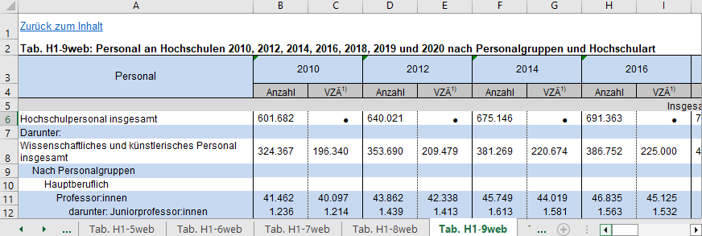

# Datenbasis: Nationaler Bildungsbericht 

Die Fallstudie des Datentyps "Tabelle" arbeitet mit strukturierten Daten, also Daten, die in einem vorgegebenen Format organisiert und sortiert sind. Eine ordentlich gestaltete Tabelle weist immer strukturierte Daten auf.

Der Nationale Bildungsbericht 2022 bereitet Daten für ein nationales Bildungsmonitoring aus unterschiedlichen Datenquellen auf und stellt den Report sowie die aufbereiteten Datensätze unter der URL [https://www.bildungsbericht.de/de/startseite](https://www.bildungsbericht.de/de/startseite) bereit. Es gibt jeweils eine Online-Version (im Format PDF) und eine Printversion. Die aufbereiteten Daten werden im Excel-Format zum Download bereitgestellt. 

Die für die Forschungsfrage relevanten Informationen zur Entwicklung des Hochschulpersonals finden sich im Kapitel H - "Bildungspersonal: Struktur, Entwicklung, Qualität und Professionalisierung", das unter [https://www.bildungsbericht.de/de/bildungsberichte-seit-2006/bildungsbericht-2022/pdf-dateien-2022/bildungsbericht-2022-kapitel-h.pdf](https://www.bildungsbericht.de/de/bildungsberichte-seit-2006/bildungsbericht-2022/pdf-dateien-2022/bildungsbericht-2022-kapitel-h.pdf) auch einzeln aufrufbar ist, auf S. 258 ff. Die Visualisierungen Abb. H1-3 (S. 259) und Abb. H1-4 (S. 260) fokussieren sich auf die Verteilung des haupt- und nebenberuflichen Personals bzw. das aus Grundmitteln finanzierte Personal im Verhältnis zur Studierendenzahl. 

Für diese Fallstudie ist die erstgenannte Abbildung H1-3 von Bedeutung, die sich auf die Tabelle H1 - "Personalbestand und Personalstruktur" bezieht, die analog zum Bildungsbericht über folgenden Link bezogen werden kann: [https://www.bildungsbericht.de/de/bildungsberichte-seit-2006/bildungsbericht-2022/excel-bildungsbericht-2022/h1-anhang.xlsx](https://www.bildungsbericht.de/de/bildungsberichte-seit-2006/bildungsbericht-2022/excel-bildungsbericht-2022/h1-anhang.xlsx).

*Abbildung 1: Abb.H1-3 aus dem nationalen Bildungsbericht 2022*

Die Daten, die zur Erzeugung der Visualisierung verwendet wurden, finden sich im Reiter "H1-9web: Personal an Hochschulen 2010, 2012, 2014, 2016, 2018, 2019 und 2020 nach Personalgruppen und Hochschulart" der Excel-Tabelle.

*Abbildung 2: Tab.H1-9web*

Da es sich bei dieser Tabelle um aggregierte Daten handelt, ist es sinnvoll, die Rohdaten für diese Daten zu suchen, da die Daten im Rahmen der Fallstudie im Sinn der Reproduzierbarkeit erneut analysiert werden sollen und sich Daten im CSV-Format besser weiterverarbeiten lassen als im Excel-Format. 
Bevor wir das tun, werden wir Sie im nächsten Kapitel aber zunächst mit dem Thema Datennachnutzung vertraut machen. Dazu untersuchen wir die Qualität unseres Datensatzes anhand der FAIR-Prinzipien.

*Falls Ihnen die FAIR-Prinzipien bereits vertraut sind, können Sie auch direkt zu Kapitel 5 springen.*
