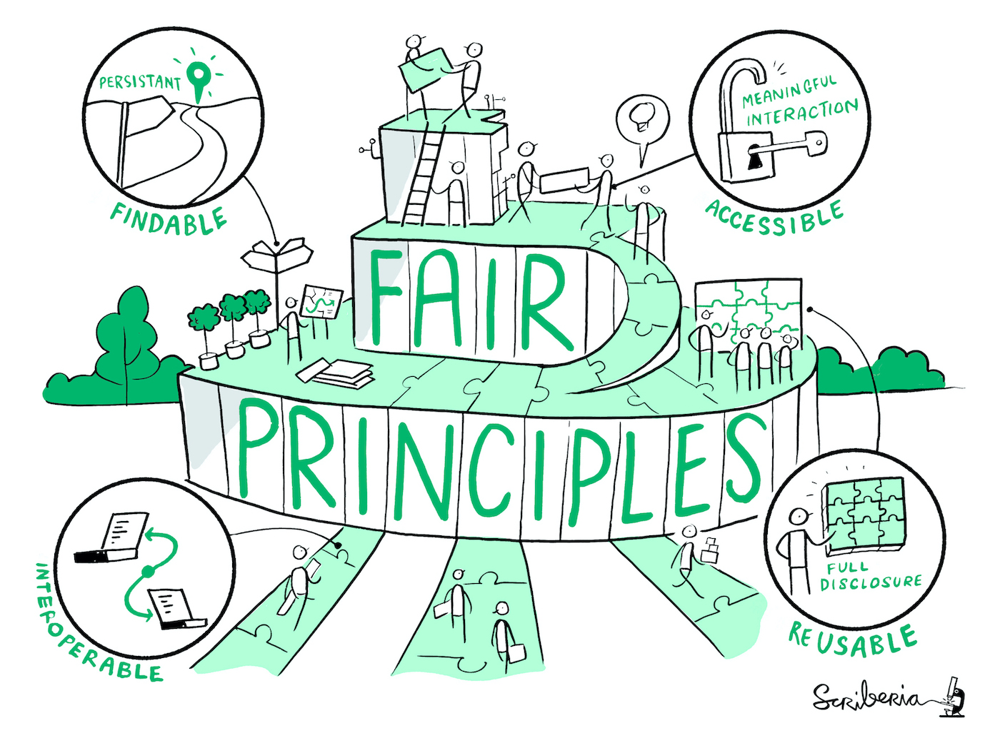

# FAIR-Prinzipien

In Bezug auf die Nachnutzung, aber auch hinsichtlich der Qualität von Daten(sätzen) wollen wir Sie hier mit den FAIR-Prinzipien vertraut machen. Diese stellen Grundsätze des Datenmanagements dar, die unter anderem den Austausch und die weitere Nutzung von Daten vereinfachen. FAIR ist das Akronym von **F**indable, **A**ccessible, **I**nteroperable und **R**eusable - also auffindbar, zugänglich, interoperabel (bzw. kompatibel) und wiederverwendbar. Diese 2016 veröffentlichten Prinzipien, die seit 2019 auch in den "Leitlinien zur Sicherung guter wissenschaftlicher Praxis" der Deutschen Forschungsgemeinschaft (DFG, https://www.dfg.de/resource/blob/173732/4166759430af8dc2256f0fa54e009f03/kodex-gwp-data.pdf) verankert sind, haben sich mittlerweile zu einem Standard entwickelt {cite}`spiecker_ecodm_2022`.

Bildquelle: The Turing Way Community, & Scriberia. (2020). Illustrations from the Turing Way book dashes. Zenodo. https://doi.org/10.5281/zenodo.3695300

Die **Auffindbarkeit** von Daten lässt sich zum Beispiel durch die Verwendung von Persistenten Identifikatoren (s. [Kapitel PID](PID)) für Daten und Datensätze wesentlich vereinfachen. Weiterhin sollten Forschungsdaten immer mit Quellen versehen werden wie es die fachspezifischen Standards erfordern (s. [Kapitel Datenzitierung](Einleitung_Datenzitierung)). Darüber hinaus sollten die Daten mit zahlreichen Metadaten beschrieben werden, für die ebenfalls disziplinspezifische Standards und Schemata vorliegen {cite}`hollander_parthenos_nodate`.

Unter **Zugänglichkeit** fällt die Auswahl eines vertrauenswürdigen Repositoriums als Speicherort für die Daten(sätze) und die klare Regelung des Zugriffs auf diese sowie die Verwendung von standardisierten Protokollen {cite}`hollander_parthenos_nodate`.

Eine **Interoperabilität** von Daten(sätzen) lässt sich einstellen, wenn Daten sowohl von Menschen als auch Maschinen einfach mit anderen Daten(sätzen) verknüpft werden können. Dies lässt sich durch gut dokumentierte und maschinenlesbar APIs, eindeutig definierte, für das Fachgebiet relevante Vokabulare und offene, standardisierte Dateiformate erreichen {cite}`hollander_parthenos_nodate`.

Die **Wiederverwendbarkeit** von Daten lässt sich von vornherein unterstützen, indem transparent dokumentiert wird, was die Daten beinhalten. Die präzise Benennung von Daten - auch nach Konventionen - erleichtert eine Nachnutzung ebenfalls. Die Nutzung von gängigen, in der Disziplin typischen Formaten ist hier erneut zu nennen und schließlich vereinfacht zudem die Verwendung von Lizenzen die Nachnutzung von Daten erheblich, da dadurch klar definiert ist, wer welche Rechte hat und wer die Daten wie verwenden darf {cite}`hollander_parthenos_nodate`.

Further Reading:

Eine detaillierte Ausformulierung der Prinzipien findet sich auf https://www.go-fair.org/fair-principles/. Zum Prüfen der sogenannten FAIRness von Daten haben sich Checklisten etabliert. Eine von diesen ist die von Jones & Grootveld (2017), die sich bei Zenodo findet (https://zenodo.org/records/5111307). Sie stellt die Basis für die Übung im nächsten Kapitel dar.
