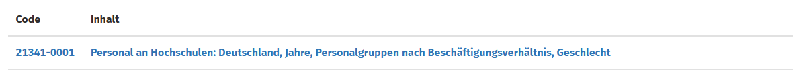
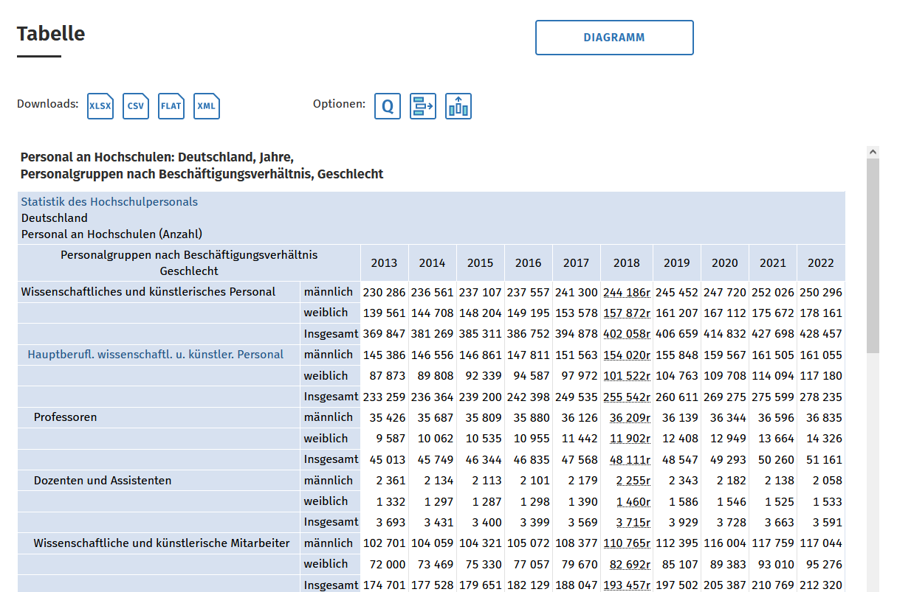

# XLSX und CSV

Als Einstieg in das Kapitel Qualitätsbewertung, lassen Sie uns noch einmal einen Blick auf die Daten werfen. Aus der Bewertung der FAIRness der Daten ging bereits hervor, dass Daten im Format XLSX unter bestimmten Gesichtspunkten Einschränkungen unterliegen können.

Dies unterstreicht das kurze Tutorial zu Datenqualität und Maschinenlesbarkeit tabellarischer Daten in Bezug auf CSV und XLSX, dass von der [Open Data Informationsstelle Berlin](https://odis-berlin.de/), einem Projekt der [Technologiestiftung Berlin](https://www.technologiestiftung-berlin.de/) erstellt wurde. Dort erfahren Sie u. a., wie sich die beiden Formate unterscheiden und warum Excel-Tabellen oft nicht einwandfrei maschinenlesbar sind. Das Video wurde unter der Lizenz CC BY veröffentlicht.

[https://www.youtube.com/embed/Nb_cLObVKho?si=cuM3HATsLLsvbk-h](https://www.youtube.com/embed/Nb_cLObVKho?si=cuM3HATsLLsvbk-h)

---

Da Sie ab diesem Kapitel mit einem CSV-Datensatz arbeiten werden, muss die Excel-Tabelle des Berichts umgewandelt werden. Da sie nicht konvertiert werden soll und die Tabellen des Berichts nur im Format XLSX zur Verfügung stehen, muss die Rohdatenquelle für die Daten ermittelt werden.

Am Ende der Tabelle H1-9web wird als Quelle für die Rohdaten u. a. auf das Statistische Bundesamt [Destatis](https://www-genesis.destatis.de/genesis/online) verwiesen. 

Dort sind die relevanten Daten praktischerweise nach kurzer Recherche (Suche nach "Personal" und "Hochschule") auszumachen. Angezeigt werden mehrere Tabellen. Die benötigte hat den Code 21341-0001.

Wenn Sie den Abruf starten, wird Ihnen die Tabelle bereits angezeigt. Sie können die Daten nun in verschiedenen Formaten auswählen.

Wählen Sie CSV aus und der Datensatz wird im Format CSV heruntergeladen.

Wunderbar, damit sind Sie bereit für die folgenden Kapitel!
